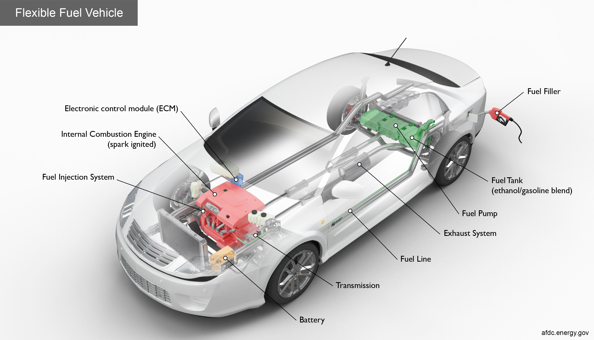
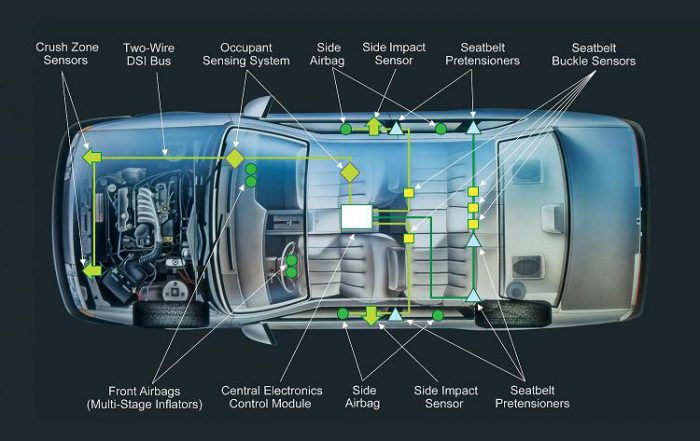
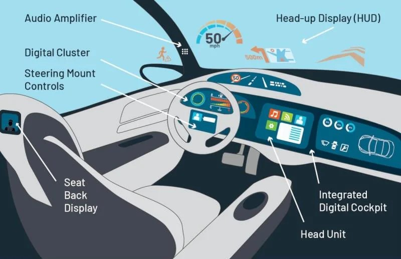
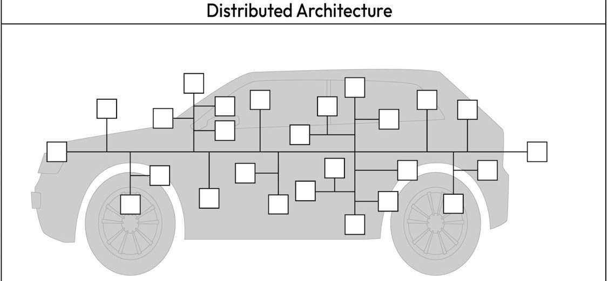
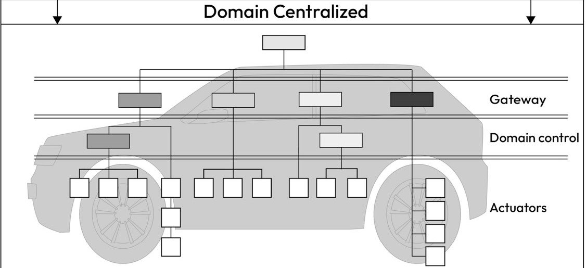
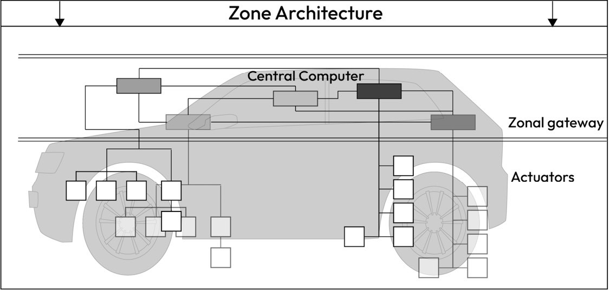

# Vehicle Electrical/Electronic Architecture

Vehicle Electrical/Electronic (E/E) architecture refers to the overall design and integration of a vehicle's electrical and electronic systems, encompassing hardware, software, and communication networks. It defines how components such as sensors, actuators, electronic control units (ECUs), wiring, and communication protocols (e.g., CAN, LIN, Ethernet) are organized and interconnected to enable vehicle functionality. Modern E/E architectures are evolving to support increasing system complexity, including advanced driver-assistance systems (ADAS), infotainment, and electrification, while meeting stringent requirements for performance, scalability, safety, and cybersecurity.

---

## Electronic Control Units (ECUs)

An Electronic Control Unit (ECU) is an embedded system within automotive electronics that manages a system or task in a vehicle. ECUs act as the brains processing sensory or other relevant data to send control signals to actuators and interfaces. Like most embedded systems, ECUs can take many hardware forms such as microcontrollers, microprocessors, ASICs, and FPGAs.

---

## Automotive domains

A domain refers to a system typically composed of a collection of ECUs and their subordinate systems, working together to perform a specific vehicle-level function. What a domain is and which electronics belong in each domain can vary depending on who you ask and the specifics of the vehicle, especially as vehicles become more complex and interconnected over time. Below is how [Dr. Ahmad MK Nasser](#references) breaks down the domains and provides some example ECUs/Modules for each. I added some images from seperate sources to help visualize these domains.Notice how the images don't line up with Dr. Ahmad's example ECUs, automotive electronics changes wildly depending on the specific vehicle type, manufacturer, model, trim, and even specific factories.

### **Fuel-Based Powertrain Domain**

This domain manages internal combustion engines (ICEs), focusing on tasks such as engine performance, gear shifting, and emissions control.

- **Engine Control Module (ECM)**: Regulates engine functions, including ignition timing, fuel injection, and engine cooling
- **Transmission Control Module (TCM)**: Optimizes gear shifting in automatic transmissions by analyzing input data such as engine speed, vehicle speed, throttle position

### **Electric Drive Powertrain Domain**

This domain handles battery management and electric motor control in electric vehicles (EVs).

- **Battery Management System (BMS)**: Monitors the state of charge (SoC) and state of health (SoH), and ensures battery safety and thermal management.
- **Powertrain Electronic Control Unit (PECU)**: Manages motor speed and acceleration, and controls voltage and frequency supplied to the motor.

### Chassis Safety Control Domain

The chassis domain ensures vehicle stability and safety through active and passive safety systems.

- **Electronic Braking Control Module (EBCM)**: Provides functions like ABS, ESC, and emergency braking.
- **Electronic Power Steering (EPS)**: Assists steering and enables lane correction.
- **Airbag Control Module**: Deploys airbags during collisions for passenger safety.
- **Advanced Driver Assistance (ADAS) control module**: In modern vehicles, a dedicated ECU is often used to achieve advanced levels of autonomy, even though some ADAS functions can be integrated into the EBCM and EPS. This specialized module coordinates with the ECM, EBCM, and EPS to manage engine torque, braking, and steering as required by the situation. By processing inputs from various sensors, the ADAS ECU enables features like autonomous highway driving and automated parking, among other autonomy functions.

### Interior Cabin Domain

This domain focuses on comfort, convenience, and security features.

- **Body Control Module (BCM)**: Controls keyless entry, seat adjustments, and lighting.
- **Climate Control Module (CCM)**: Manages cabin heating, cooling, and ventilation.

### Infotainment and Connectivity Domain

This domain integrates driver and passenger-facing interfaces, focusing on entertainment and connectivity. As you would expect, this domain is becoming increasing significant to electronics engineers due to advancments in V2X communications.

- **In-Vehicle Infotainment (IVI)**: Provides entertainment, navigation, and driver information.
- **Telematics Control Unit (TCU)**: Facilitates GPS, remote connectivity, and over-the-air (OTA) updates.

### Cross-Domain Communication

Cross-domain functionality provides a reliable communication framework for inter-domain message exchange.

- **Central Gateway (CGW)**: Acts as an in-vehicle router, enabling communication across different network segments (e.g., CAN to Ethernet) and supporting cybersecurity measures to block unwanted traffic.

---

## Vehicle Architecture Types

The design of a vehicle's electrical and electronic (E/E) architecture significantly impacts functionality, security, and resource usage. Over time, E/E architectures have evolved from highly distributed systems to more centralized configurations, aiming to consolidate vehicle functions and enhance computational power. This evolution can be categorized into three main types: highly distributed architectures, domain-centralized architectures, and zone architectures.

**Note:** Vehicle manufacturers (OEMs) may adopt different approaches to evolving their E/E architectures. As a result, some vehicles may feature hybrid architectures that are transitional stages between the types described here. The evolution of vehicle E/E architecture is ongoing, and new architectural classes may emerge in the future.

### Highly Distributed E/E Architecture

In a highly distributed architecture, Electronic Control Units (ECUs) are grouped based on similar or interdependent functionalities within shared network segments. Communication protocols such as Controller Area Network (CAN), Local Interconnect Network (LIN), or FlexRay facilitate message exchange between these ECUs. This architecture enables direct mapping between vehicle functions and specific ECUs.

However, the addition of new functionalities often requires local gateways to relay messages between network segments (e.g., CAN to LIN). While this allows for scalability without a complete network redesign, it introduces vulnerabilities. Gateways may fail to isolate network segments effectively, increasing the risk of unauthorized access to critical ECUs. Additionally, ECUs with varying levels of security exposure—such as infotainment systems and safety-critical ECUs like braking systems—may be grouped together, heightening security risks.

The On-Board Diagnostics (OBD) connector also presents a potential security issue. It is typically connected directly to internal network segments, such as the powertrain or chassis domains, providing a potential entry point for attackers.

### Domain-Centralized E/E Architecture

The domain-centralized E/E architecture addresses the challenges of cost, maintenance, and security seen in highly distributed systems. In this configuration, ECUs are grouped into well-defined domains (e.g., powertrain, chassis, infotainment, and body), and communication between these domains is managed through dedicated gateways.

A central gateway equipped with a high-speed Ethernet backbone serves as the communication hub, enabling high-bandwidth data transfer across domains. This setup supports advanced features like Diagnostics over IP (DoIP), allowing parallel flashing and diagnostics of multiple ECUs. The gateway enforces network filtering rules, improving security by isolating domains from unauthorized access.

By consolidating multiple ECUs into domain-specific controllers, this architecture simplifies maintenance, reduces complexity, and enhances overall security by minimizing the attack surface.

### Zone Architecture

Zone architecture represents the next step in E/E architecture evolution. This configuration employs powerful vehicle computers or zone ECUs, which connect directly to sensors and actuators within specific physical areas of the vehicle. This design reduces the total number of ECUs, enhances computational efficiency, and simplifies network structures.

Zone architectures improve scalability and flexibility while providing robust security. Functions are isolated within distinct zones, making it easier to implement security controls and monitor communications. This design supports advanced features such as autonomous driving and over-the-air updates, meeting the demands of modern vehicles.

## References

1. Ahmad MK Nasser, *Automotive Cybersecurity Engineering Handbook*.

## Image Sources

1. [Electric Drive Powertrain Domain](#electric-drive-powertrain-domain): https://evreporter.com/ev-powertrain-components/
2. [Fuel-Based Powertrain Domain](#fuel-based-powertrain-domain): https://afdc.energy.gov/files/vehicles/flexfuel-high-res.jpg
3. [Chassis Safety Control Domai](#chassis-safety-control-domain): https://www.automotivesafetycouncil.org/wp-content/uploads/2017/01/air-bag-sensor-car-layout-700x441.jpg
4. [Interior Cabin Domain](#interior-cabin-domain): https://d17ocfn2f5o4rl.cloudfront.net/wp-content/uploads/2019/01/In-car-electronics-controlled-via-BCM.jpg
5. [Infotainment and Connectivity Domain](#infotainment-and-connectivity-domain): https://www.tek.com/en/blog/taking-in-vehicle-infotainment-into-the-future
6. [Vehicle Architecture Types](#vehicle-architecture-types): Ahmad MK Nasser, *Automotive Cybersecurity Engineering Handbook*.