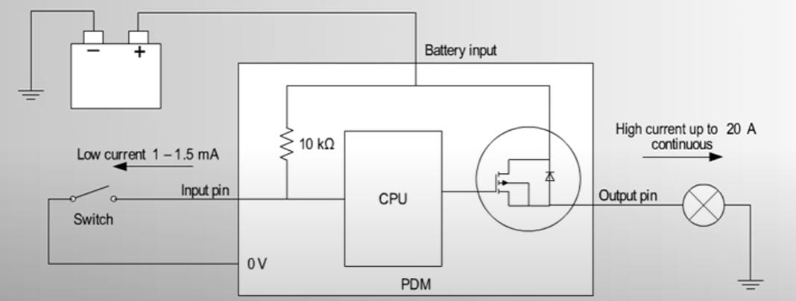
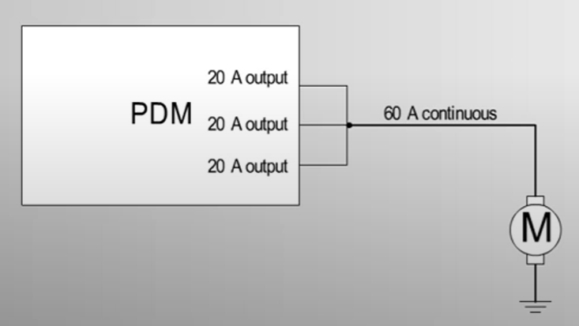

# MoTeC's Power Distribution Module (PDM)

## Overview
MoTeC's Power Distribution Module (PDM) is an advanced, fully programmable solution for managing the power supply of complex electrical systems in automotive, motorsport, marine, and industrial applications. By replacing traditional fuses and relays with solid-state electronics, the PDM improves reliability, reduces wiring complexity, and enables enhanced system diagnostics.

---

## Key Features

**1. Solid-State Switching**

- Eliminates mechanical relays and fuses, providing long-lasting reliability.
- Enables precise control over current flow and voltage levels.

**2. Fully Programmable**

- Customizable logic for power distribution and circuit protection.
- Configurable via MoTeC's software to suit various applications.

**3. Advanced Diagnostics**

- Continuous monitoring of current, voltage, and temperature for all channels.
- Real-time feedback for troubleshooting and optimization.

**4. Lightweight and Compact Design**

- Reduces overall weight and space requirements compared to traditional wiring systems.
- Ideal for high-performance and space-constrained applications.

**5. Flexible Inputs and Outputs**

- Multiple input and output channels for integration with complex electrical systems.
- Options for both high-current and low-current loads.

---

## Benefits

- **Enhanced Safety**: Real-time current monitoring prevents overloads and short circuits.
- **Simplified Wiring**: Reduces the need for traditional fuse and relay blocks.
- **Ease of Integration**: Seamless compatibility with other MoTeC products such as ECUs and data loggers.
- **Scalability**: Suitable for applications ranging from small vehicles to large industrial systems.

---

## Input / Output Circuitry

## Increase Max Amps

## Resources

1. [MoTeC's official website](https://www.motec.com.au/products/category/Power%20Distribution%20Modules/Overview?id=2).
