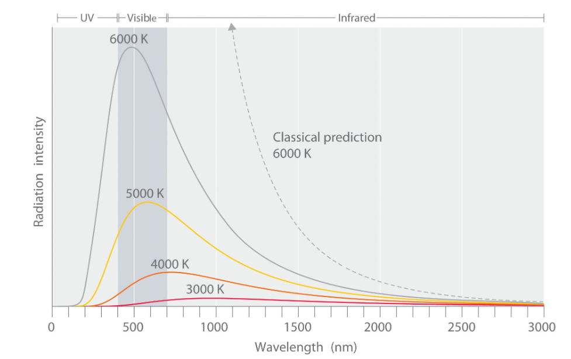

# The Wave Function

### Schrödinger’s Equation
The Schrödinger equation is the cornerstone of quantum mechanics. It describes how the wave function of a quantum system evolves over time:

$$
i \hbar \frac{\partial \psi}{\partial t} = \hat{H} \psi
$$

where:
- `i` is the imaginary unit (√-1),
- `ℏ` is the reduced Planck’s constant,
- `ψ(x, t)` is the wave function, representing the quantum state of the system,
- `Ĥ` is the Hamiltonian operator, representing the total energy of the system (kinetic + potential).

### The Wave Function
The wave function, `ψ(x, t)`, is a complex-valued function that encapsulates all the information about a quantum system. It serves as a mathematical representation of the particle's quantum state, containing information about properties such as position, momentum, and energy.

**Absolute Value of the Wave Function**
The absolute value squared of the wave function, `|ψ(x, t)|^2`, is interpreted as the probability density of finding a particle at position `x` and time `t`. This interpretation was introduced by Max Born and is central to the probabilistic nature of quantum mechanics.

Key points about the absolute value:
- **Probability Density**: `|ψ(x, t)|^2` represents the likelihood of locating a particle in a specific region of space. For example, in one dimension, the probability of finding the particle between positions `a` and `b` is given by:
  $$
  P(a \leq x \leq b) = \int_a^b |ψ(x, t)|^2 dx
  $$  
- **Normalization**: The total probability of finding the particle in all space must be 1. This imposes the normalization condition:
  
  $$
  \int_{-\infty}^{\infty} |ψ(x, t)|^2 dx = 1
  $$
  
- **Interpretation**: While the wave function itself is a complex number, only its absolute value squared has a physical interpretation.

### The Hamiltonian
The Hamiltonian operator, `Ĥ`, defines the total energy of a quantum system and can take different forms depending on the system being studied. Some common examples include:

1. **Free Particle**:
   $$
   \hat{H} = -\frac{\hbar^2}{2m} \nabla^2
   $$
   - Represents a particle with no potential energy, only kinetic energy.

2. **Particle in a Potential**:
   $$
   \hat{H} = -\frac{\hbar^2}{2m} \nabla^2 + V(x)
   $$
   - Includes a potential energy term, `V(x)`.

3. **Harmonic Oscillator**:
   $$
   \hat{H} = -\frac{\hbar^2}{2m} \nabla^2 + \frac{1}{2} m \omega^2 x^2
   $$
   - Describes systems like vibrating molecules or quantum springs.

4. **Hydrogen Atom**:
   $$
   \hat{H} = -\frac{\hbar^2}{2m} \nabla^2 - \frac{e^2}{4 \pi \epsilon_0 r}
   $$
   - Models the interaction between an electron and a proton.

The form of the Hamiltonian determines the dynamics of the quantum system and governs the evolution of the wave function over time.

## A Brief History of the Development of the Wave Function
### Early Wave Theories and Foundations

**Light as a Wave**
- **Christiaan Huygens (1678)**: Proposed the wave theory of light, suggesting that light travels as waves, contrary to Isaac Newton's particle theory.
- **Thomas Young (1801)**: Demonstrated light's wave nature through the double-slit experiment, revealing interference patterns.
- **Augustin-Jean Fresnel (1816)**: Expanded on Huygens' principle, mathematically explaining diffraction and interference.

**Electromagnetism and Light**
- **Michael Faraday (1831)**: Introduced the concept of electromagnetic fields, showing the interplay between electricity and magnetism.
- **James Clerk Maxwell (1861–1865)**: Unified electricity, magnetism, and optics with Maxwell's equations, proving light to be an electromagnetic wave.

### Atomic Models and Discrete Energies

**The Atom and Subatomic Discoveries**
- **John Dalton (1803)**: Proposed that matter is composed of indivisible atoms.
- **Dmitri Mendeleev (1869)**: Developed the periodic table, emphasizing the discrete properties of elements.
- **J.J. Thomson (1897)**: Discovered the electron, introducing subatomic particles to atomic theory.

**Rutherford’s Contributions**
- **Ernest Rutherford (1911)**: Conducted the gold foil experiment, leading to the nuclear model of the atom with a dense nucleus surrounded by electrons. This model raised questions about electron stability and atomic spectra.

### The Quantum Revolution

**[Blackbody Radiation](#blackbody-thermal-radiation-problem-and-its-solution) and Quantization**
- **Max Planck (1900)**: Solved the blackbody radiation problem by introducing energy quantization: $E = h \nu$, where $h$ is Planck's constant and $\nu$ is the frequency.
- **Albert Einstein (1905)**: Explained the photoelectric effect using quantized light particles (photons), supporting the wave-particle duality of light.

#### Atomic Spectra and Discrete Energy Levels
- **Niels Bohr (1913)**: Introduced the Bohr model, explaining hydrogen's spectral lines via quantized electron orbits.

### Matter Waves and the Schrödinger Wave Function

**[Wave-Particle Duality](#particles-acting-like-waves-and-waves-acting-like-particles)**
- **Louis de Broglie (1924)**: Proposed that matter exhibits wave-like behavior, with a wavelength given by:
  $$
  \lambda = \frac{h}{p}
  $$
  where `p` is the momentum.

- **Albert Einstein (1905)**: Demonstrated the particle-like behavior of light through the photoelectric effect, showing that light is made up of discrete packets of energy called photons.

- **Werner Heisenberg (1927)**: Introduced the uncertainty principle, which states that certain pairs of physical properties, such as position and momentum, cannot be simultaneously measured with arbitrary precision.

**[Schrödinger’s Equation](#schrödingers-equation)**
- **Erwin Schrödinger (1926)**: Developed the wave equation to describe quantum systems. The wave function $\psi(x, t)$ represents the quantum state of a particle and evolves according to:
  $$
  i \hbar \frac{\partial \psi}{\partial t} = \hat{H} \psi
  $$
  where $\hat{H}$ is the Hamiltonian operator. Schrödinger's work explained atomic phenomena such as electron orbitals.

### Probabilistic Nature of Quantum Mechanics

**Interpretation of the Wave Function**
- **Max Born (1926)**: Interpreted $\psi$ as a probability amplitude, with $|\psi|^2$ giving the probability density of finding a particle in a given state. This marked a departure from deterministic classical mechanics.

**Complementarity and Uncertainty**
- **Werner Heisenberg (1927)**: Formulated the uncertainty principle, limiting the simultaneous measurement of properties like position and momentum.
- **Niels Bohr**: Advocated for complementarity, asserting the dual wave-particle nature of quantum systems.

## Blackbody (Thermal) Radiation Problem and Its Solution

### The Blackbody Radiation Problem

Blackbody radiation refers to the electromagnetic radiation emitted by an idealized object that absorbs all incident radiation, regardless of wavelength or angle. This object, called a blackbody, emits radiation solely based on its temperature. By the late 19th century, experimental studies of blackbody radiation revealed discrepancies that classical physics could not explain.

**Classical Predictions**
- **Rayleigh-Jeans Law**: Classical physics, using the equipartition theorem, predicted that the intensity of blackbody radiation at short wavelengths (high frequencies) would grow infinitely, leading to what became known as the *ultraviolet catastrophe*. Mathematically, the intensity \( I(\nu, T) \) was given by:
$$
I(\nu, T) = \frac{8 \pi \nu^2}{c^3} k_B T
$$

Where:
- **ν**: Frequency of radiation
- **c**: Speed of light
- **k_B**: Boltzmann constant
- **T**: Temperature of the blackbody

  This equation worked well at long wavelengths (low frequencies) but diverged at high frequencies, predicting an infinite energy output, which was physically impossible.

**Experimental Results**
Experimental data showed that the radiation intensity increased with frequency, peaked at a certain value, and then declined at higher frequencies. Classical theories failed to reproduce this behavior, prompting the need for a new explanation.

*Source: [LibreTexts Chemistry - Blackbody Radiation Cannot Be Explained Classically](https://chem.libretexts.org/Courses/Pacific_Union_College/Quantum_Chemistry/01:_The_Dawn_of_the_Quantum_Theory/1.01:_Blackbody_Radiation_Cannot_Be_Explained_Classically)*

### The Solution by Max Planck

In 1900, Max Planck proposed a revolutionary solution that marked the birth of quantum theory. Planck introduced the idea that energy is not continuous but quantized. He suggested that electromagnetic radiation is emitted or absorbed in discrete packets, called *quanta*, with energy:
$$
E = h \nu
$$
where:
- **h**: Planck's constant (\(6.626 \times 10^{-34} \, \text{Js}\))
- **v**: Frequency of radiation

#### Planck’s Law
Using this assumption, Planck derived an equation that accurately described the observed blackbody radiation spectrum:
$$
I(\nu, T) = \frac{8 \pi h \nu^3}{c^3} \frac{1}{e^{\frac{h \nu}{k_B T}} - 1}
$$
This equation successfully matched experimental data at all wavelengths, resolving the ultraviolet catastrophe.

### Implications of Planck's Solution

1. **Quantization of Energy**: Planck's hypothesis introduced the concept of quantized energy levels, fundamentally challenging the continuous energy assumptions of classical physics.
2. **Wave-Particle Duality**: The idea of energy quanta set the stage for the later development of wave-particle duality, where light and matter exhibit both wave-like and particle-like properties.
3. **Foundation of Quantum Mechanics**: Planck’s work paved the way for subsequent discoveries in quantum theory, including the photoelectric effect (Einstein), matter waves (de Broglie), and the wave function (Schrödinger).

## Particles Acting Like Waves and Waves Acting Like Particles

The development of quantum mechanics was heavily influenced by the realization that particles can exhibit wave-like behavior, and waves can exhibit particle-like behavior. This duality challenged the traditional boundaries between particles and waves in classical physics and became a cornerstone of quantum mechanics.

### Waves Acting Like Particles

**Photoelectric Effect**
- **Discovery**: The photoelectric effect demonstrated that light behaves like discrete packets of energy, called photons, rather than a continuous wave.
- **Albert Einstein (1905)**: Explained that when light of sufficient frequency strikes a metal surface, it ejects electrons. This effect could not be explained by the wave theory of light, which predicted that energy would depend on the intensity of the light rather than its frequency.
- **Key Equation**: Einstein's explanation relied on the quantization of light energy:
  $$
  E = h \nu
  $$
  where:
  - `E` is the energy of a photon,
  - `h` is Planck's constant, and
  - `ν` is the frequency of light.
- **Significance**: This discovery provided direct evidence of the particle nature of light and introduced the concept of photons, supporting the idea of wave-particle duality.

**Compton Scattering**
- **Arthur Compton (1923)**: Showed that X-rays scattered off electrons exhibit changes in wavelength consistent with treating X-rays as particles (photons) colliding with electrons. This reinforced the particle-like behavior of waves.

### Particles Acting Like Waves

**de Broglie's Hypothesis**
- **Louis de Broglie (1924)**: Proposed that matter, like light, exhibits wave-like properties. He introduced the concept of matter waves, with the wavelength of a particle given by:
  $$
  \lambda = \frac{h}{p}
  $$
  where:
  - `λ` is the wavelength of the particle,
  - `h` is Planck's constant, and
  - `p` is the momentum of the particle.
- **Implications**: This hypothesis suggested that all particles, including electrons, have associated wave properties, which was later confirmed experimentally.

**Electron Diffractio**n
- **Davisson-Germer Experiment (1927)**: Demonstrated the wave-like behavior of electrons by showing that they produce diffraction patterns when scattered off a crystal. This experiment provided direct evidence of de Broglie's matter waves.

### Wave-Particle Duality

Wave-particle duality is the principle that particles and waves exhibit both wave-like and particle-like properties depending on the experiment:
- **For Light**: Light behaves as a wave in phenomena like interference and diffraction, but as particles (photons) in phenomena like the photoelectric effect.
- **For Matter**: Particles like electrons behave as localized entities in some contexts but exhibit wave-like behavior, such as interference and diffraction, in others.

### Impact on Quantum Mechanics

1. **Quantum Theory of Radiation**: The particle-like behavior of light and wave-like behavior of particles necessitated a new theory for describing phenomena at small scales.
2. **Wave Function**: Schrödinger’s wave equation formalized the concept of wave-particle duality, describing particles as wave functions that evolve in time.
3. **Heisenberg's Uncertainty Principle**: The duality introduced fundamental limits to simultaneously measuring properties like position and momentum:
   $$
   \Delta x \cdot \Delta p \geq \frac{\hbar}{2}
   $$
   where:
   - `Δx` is the uncertainty in position,
   - `Δp` is the uncertainty in momentum, and
   - `ℏ` is the reduced Planck's constant.

# Resources
1. [LibreTexts Chemistry - Blackbody Radiation Cannot Be Explained Classically](https://chem.libretexts.org/Courses/Pacific_Union_College/Quantum_Chemistry/01:_The_Dawn_of_the_Quantum_Theory/1.01:_Blackbody_Radiation_Cannot_Be_Explained_Classically)
2. [Quanta and Fields by Sean Carroll](https://www.amazon.com/Quanta-Fields-Biggest-Ideas-Universe/dp/0593186605)

---

  <a href="index.md"><- Overview</a>
  <a href="measurement.md">Measurement -></a>

