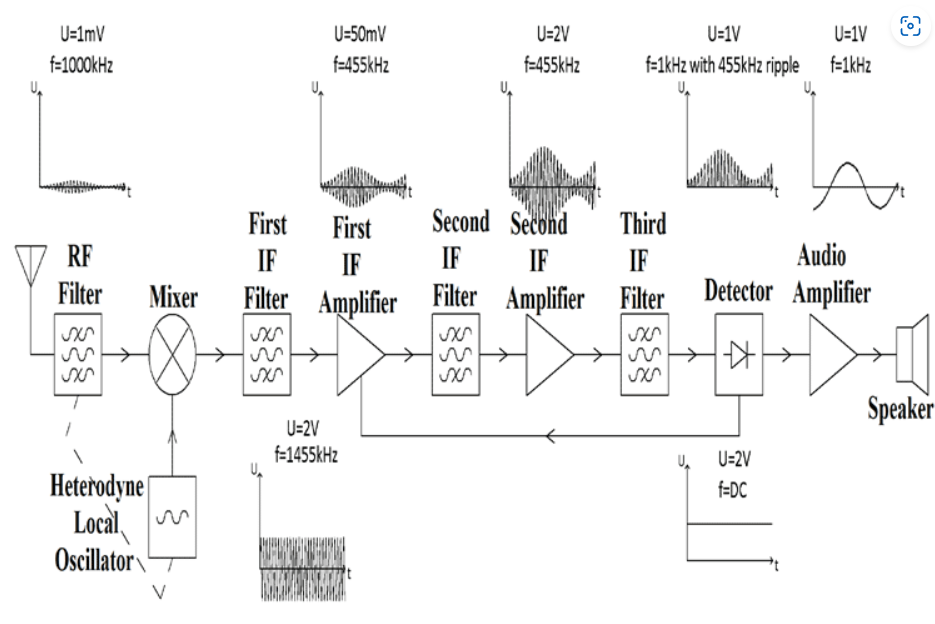
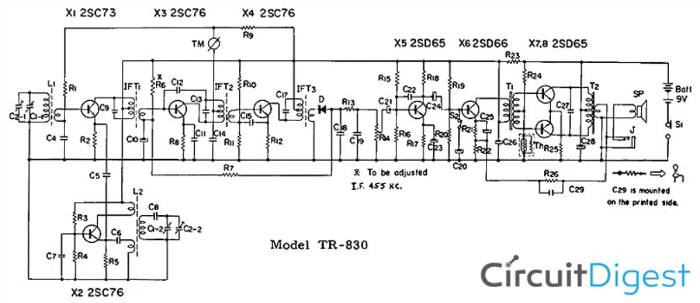
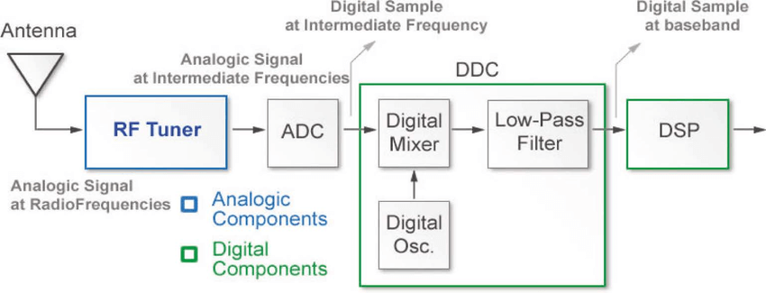

# Introduction to Digital Signal Processing (DSP)

---

## What is DSP?

Digital Signal Processing (**DSP**) involves analyzing, manipulating, and synthesizing signals using digital techniques. Rather than working directly with continuous-time signals (as in analog systems), DSP first converts analog signals into a sequence of discrete samples.

- **Sampling**: Converting a continuous-time signal \( x(t) \) into a discrete-time sequence \( x[n] \) by taking periodic snapshots at intervals \( T_s \).  
- **Quantization**: Mapping each sample to a finite set of integer levels.  

Thus, a continuous waveform is represented in a digital form suitable for storage, transmission, or further numerical processing.

---

## Comparing Analog and Digital

Analog systems handle continuously varying voltages, currents, or other physical quantities. Digital systems, on the other hand, work with discrete numerical values (bits).

**Analog Systems**  
  - Continuous in time and amplitude.  
  - Subject to noise accumulation over long distances.  
  - Hardware-based filters (resistors, capacitors, inductors) adjust frequency response.

**Superheterodyne AM Receiver Block and Circuit Diagrams**

To gain idea of the incresed hardware complexity associated with anaolog system, above is the Block and circuit diagram of a Superheterodyne AM Receiver. See refrences for a deeper dive. Compare it to the SDR below.

**Digital Systems**  
  - Discrete in time and amplitude.  
  - Noise-resistant (regeneration of binary signals can reduce error).  
  - Highly flexible: Filters, transforms, and algorithms can be reprogrammed or updated.  

Unlike the analog system above, the SDR only needs hardware to tune the signal down to an [intermediate frequency (IF)](https://en.wikipedia.org/wiki/Intermediate_frequency) then it is sampled and handled via software.

---

## In-Phase (I) and Quadrature (Q) Signals

When a signal is transmitted or received at a particular carrier frequency \( f_c \), it can be decomposed into two orthogonal components:

1. An **in-phase** component, denoted \( I \), often aligned with a cosine wave.  
2. A **quadrature** component, denoted \( Q \), often aligned with a sine wave.

Mathematically, a bandpass signal \( s(t) \) at frequency \( f_c \) can be represented as:

$$
s(t) = I(t)\cos(2\pi f_c t) - Q(t)\sin(2\pi f_c t).
$$

**Why "In-Phase" and "Quadrature"?**  
- The two components are out of phase by \( 90^\circ \) (i.e., \(\pi/2\) radians).  
- They form an **orthogonal basis**, allowing them to be processed independently and recombined without interference.

---

## QSD and QSE

- **Quadrature Sampling Detector (QSD)**:  
  A technique for down-converting a high-frequency signal to baseband by simultaneously sampling in-phase and quadrature components.  
- **Quadrature Sampling Exciter (QSE)**:  
  The reverse operation—up-converting baseband I/Q signals to a higher, desired carrier frequency.

These approaches exploit the fact that many modern communication standards use I/Q modulation for efficient data encoding.

---

## Resources

1. [Digital Signal Processing and Software Defined Radio: Theory and Construction of the T41-EP Software Defined Transceiver by Albert F Peter and Dr. Jack Purdum](https://www.amazon.com/Digital-Signal-Processing-Software-Defined/dp/B0D25FV48C/ref=sr_1_1?crid=32LXX62AOZ0BA&dib=eyJ2IjoiMSJ9.R_1R8SigayttUZXlhcjbUW4A81TJeKH4WzOejjJGg0yTqW76tfbE7jMqHl2b3lvFOLmMS_iB7Q1Yred6XYGhaQqVh-nYOyHjen5hS1U-TN5Bqnkuj-HVJbJM_roPm40yXVPUDsv6HTXrt1uQvQfE7L8oO0EXgtDOvwYNOyBYf08QPwsQlYj0l4a2GoWp7IFYWZOBiQZIHuLQUw4S9AZzgeRp5k8hrRI3LaXKNtKexQM.GK-IyOzXyHoqx2d0XrzYOc8xjukiJunsjQGZt2ZJeQM&dib_tag=se&keywords=dsp+and+sdr+t41&qid=1736877453&sprefix=dsp+and+sdr+t41%2Caps%2C166&sr=8-1)
2. [Common Microcontroller Software Interface Standard](https://arm-software.github.io/CMSIS_6/latest/General/index.html)
3. [Superheterodyne AM Receiver - Working with Block Diagram and Schematics by Aleksander Kopyto](https://circuitdigest.com/article/superheterodyne-am-receiver)

---

[← Previous](../index) | [Next →](../more-dsp-topics)
