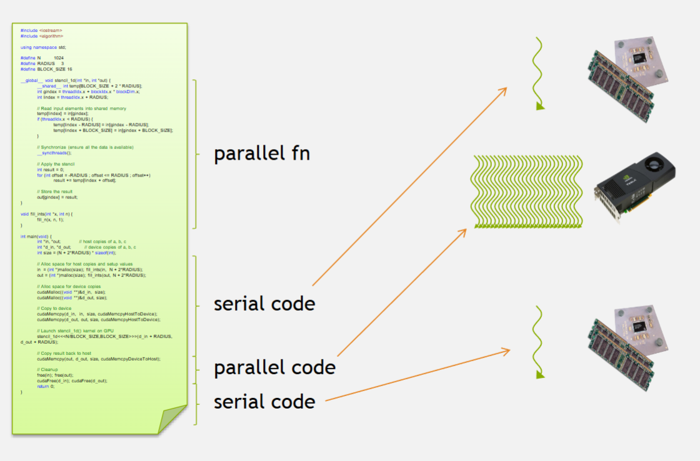
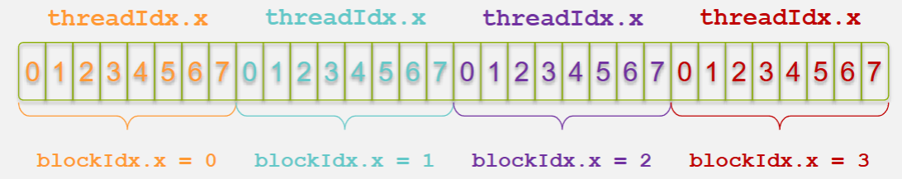
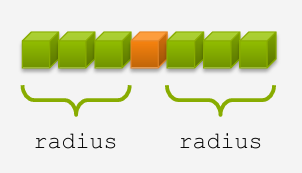
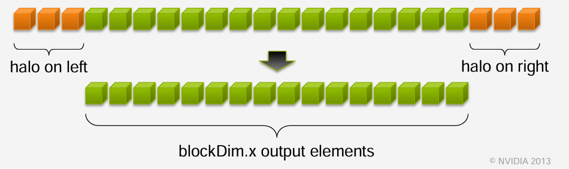

# CUDA C/C++ Programming Notes

## Overview

**What is CUDA?**  
CUDA is a parallel computing architecture developed by NVIDIA that allows developers to leverage GPU acceleration for general-purpose computing, not just graphics.

**Key points:**

- Exposes GPU parallelism for general-purpose computing while retaining high performance.
- Based on industry-standard C/C++ with a small set of extensions, like `Malloc() -> cudaMalloc()` and `Memcpy() -> cudaMemcpy()`
- Provides straightforward APIs to manage devices, memory, and kernels.
- Enables writing and launching CUDA kernels, managing GPU memory, and handling synchronization between the CPU (host) and GPU (device).

**Difference between host and device:**

- **Host:** CPU
- **Device:** GPU

**Using `__global__` to declare a function as device code:**

- Executes on the device (GPU)
- Called from the host (CPU)

---

## Heterogeneous Computing

### Host and Device relationship

- **Host:** The CPU and its associated memory; executes serial portions of code.
- **Device:** The GPU and its dedicated memory; executes parallel portions of code efficiently.




### Simple Processing Flow


---

## Hello World

### Host (CPU) Example

A simple C program running entirely on the CPU:

```c
#include <stdio.h>

int main(void) {
    printf("Hello World!\n");
    return 0;
}
```

- Standard C code executed by the CPU.
- Compiled using a standard C compiler like `gcc`.
- Outputs `Hello World!` directly.


### CUDA Device (GPU) Example

A basic CUDA C program that launches a kernel (device function) on the GPU:

```c
#include <stdio.h>

// Device kernel (does nothing here)
__global__ void mykernel(void) {
}

int main(void) {
    // Launch kernel on the GPU
    mykernel<<<1, 1>>>();

    // Host code continues
    printf("Hello World!\n");
    return 0;
}
```

- `__global__` keyword specifies a CUDA kernel (runs on GPU, called from CPU).
- Triple angle brackets `<<< >>>` indicate kernel launch parameters (1 block, 1 thread).
- Requires NVIDIA's CUDA compiler (`nvcc`) to compile.
- Kernel launch does nothing visible here; real work happens inside device code.
- Still prints `Hello World!` from the CPU (host).

---


## Addition on the Device
A basic CUDA C program performing addition on the GPU:

```c
#include <stdio.h>

// Device kernel for addition
__global__ void add(int *a, int *b, int *c) {
    *c = *a + *b;
}

int main(void) {
    int a = 2, b = 7, c;
    int *d_a, *d_b, *d_c;

    // Allocate memory on GPU
    cudaMalloc((void **)&d_a, sizeof(int));
    cudaMalloc((void **)&d_b, sizeof(int));
    cudaMalloc((void **)&d_c, sizeof(int));

    // Copy values to GPU
    cudaMemcpy(d_a, &a, sizeof(int), cudaMemcpyHostToDevice);
    cudaMemcpy(d_b, &b, sizeof(int), cudaMemcpyHostToDevice);

    // Launch kernel on GPU
    add<<<1, 1>>>(d_a, d_b, d_c);

    // Copy result back to CPU
    cudaMemcpy(&c, d_c, sizeof(int), cudaMemcpyDeviceToHost);

    // Free GPU memory
    cudaFree(d_a); cudaFree(d_b); cudaFree(d_c);

    printf("Sum: %d\n", c);
    return 0;
}
```

- `__global__` defines a kernel function to execute on the GPU.
- Uses CUDA-specific functions for memory management (`cudaMalloc`, `cudaMemcpy`, `cudaFree`).
- Kernel launch syntax (`<<<1, 1>>>`) specifies execution configuration: 1 block, 1 thread.
- Data must be explicitly transferred between host (CPU) and device (GPU).
- Compiled with NVIDIA's CUDA compiler (`nvcc`).

---


## Vector Addition on the Device

### Device Kernel

```c
__global__ void add(int *a, int *b, int *c) {
    c[blockIdx.x] = a[blockIdx.x] + b[blockIdx.x];
}
```

- Each block handles one element of the addition.
- Blocks run in parallel on the GPU.

**Example of Parallel Execution:**

- **Block 0:** `c[0] = a[0] + b[0];`
- **Block 1:** `c[1] = a[1] + b[1];`
- **Block 2:** `c[2] = a[2] + b[2];`
- **Block 3:** `c[3] = a[3] + b[3];`

### Host Code Example

```c
#define N 512

int main(void) {
    int *a, *b, *c; // host copies of a, b, c
    int *d_a, *d_b, *d_c; // device copies of a, b, c
    int size = N * sizeof(int);

    // Allocate space for device copies
    cudaMalloc((void **)&d_a, size);
    cudaMalloc((void **)&d_b, size);
    cudaMalloc((void **)&d_c, size);

    // Allocate space for host copies and setup input values
    a = (int *)malloc(size); random_ints(a, N);
    b = (int *)malloc(size); random_ints(b, N);
    c = (int *)malloc(size);

    // Copy inputs to device
    cudaMemcpy(d_a, a, size, cudaMemcpyHostToDevice);
    cudaMemcpy(d_b, b, size, cudaMemcpyHostToDevice);

    // Launch add() kernel on GPU with N blocks
    add<<<N, 1>>>(d_a, d_b, d_c);

    // Copy result back to host
    cudaMemcpy(c, d_c, size, cudaMemcpyDeviceToHost);

    // Cleanup
    free(a); free(b); free(c);
    cudaFree(d_a); cudaFree(d_b); cudaFree(d_c);

    return 0;
}
```

- Allocates and manages memory explicitly.
- Each GPU block computes one addition in parallel.
- Data transferred between host and GPU explicitly.

---


Below is a new section on **Indexing** that integrates the concepts covered on pages 37–48:

---

## Indexing

Efficient indexing is key to mapping threads to data elements in CUDA. In CUDA’s parallel programming model, each thread in a grid must be assigned a unique portion of the data. This section outlines the common strategies and formulas used for indexing in CUDA kernels.

### Basic Indexing Concepts

CUDA organizes threads into blocks, and blocks form a grid. Each thread within a block is uniquely identified by `threadIdx`, while each block in the grid is identified by `blockIdx`.



**Built-in Variables:**  

  - `threadIdx.x`: The thread’s index within its block (in the x-dimension).  
  - `blockIdx.x`: The block’s index within the grid (in the x-dimension).  
  - `blockDim.x`: The number of threads in a block (in the x-dimension). In the example above `blockDim.x = 8`

**The Indexing Formula:** When processing one-dimensional arrays, the unique global index for each thread is calculated using:
  
```c
int index = threadIdx.x + blockIdx.x * blockDim.x;
```

### Practical Example

Consider a kernel launch where each block contains 8 threads. For a thread with:
  
- `threadIdx.x = 5`  
- `blockIdx.x = 2`  
- `M = blockDim.x = 8`
  


This means that the thread processes the 22nd element (using zero-based indexing) of the array.

### Multi-Dimensional Indexing

For higher-dimensional data, CUDA supports three-dimensional configurations:
  
**2D Indexing:**  
When working with images or matrices, you may compute a unique index using both x and y dimensions:
  
```c
int col = threadIdx.x + blockIdx.x * blockDim.x;
int row = threadIdx.y + blockIdx.y * blockDim.y;
int index = row * width + col; // 'width' is the number of columns
```
  
**3D Indexing:**  

For volume data, a similar approach extends to three dimensions using `threadIdx.z`, `blockIdx.z`, and `blockDim.z`.

### Handling Arbitrary Vector Sizes

Often, the total number of data elements is not an exact multiple of the block size. To safely process all elements without accessing out-of-bound memory, include a bounds check in your kernel:

```c

__global__ void add(int *a, int *b, int *c, int n) {
    int index = threadIdx.x + blockIdx.x * blockDim.x;
    if (index < n) {
        c[index] = a[index] + b[index];
    }
}
```

- **Kernel Launch:**  
  The number of blocks is computed to cover all elements:
  
```c
  add<<<(n + blockDim.x - 1) / blockDim.x, blockDim.x>>>(d_a, d_b, d_c, n);
```
Below is a new section that covers shared memory, 1D stencils, and the use of __syncthreads() in CUDA. You can integrate this section into your notes as follows:

---

## Shared Memory, 1D Stencil, and __syncthreads()

### Overview

CUDA provides a fast, user-managed on-chip memory called **shared memory** that all threads within a block can access. This section demonstrates how to leverage shared memory for a 1D stencil operation and explains the role of the synchronization primitive `__syncthreads()`.

### Shared Memory Basics

- **Definition:**  
  Shared memory is declared with the `__shared__` keyword. It is a limited, high-speed memory region accessible by all threads within the same block.
  
- **Purpose:**  
  It is used to cache data from global memory to reduce redundant memory accesses, thereby improving performance—especially in operations that reuse data, such as stencil computations.

### The 1D Stencil Operation

A stencil operation processes each element of an input array by combining it with its neighboring elements. For example, with a **radius** of 3, each output element is computed by summing 7 consecutive elements from the input array.



#### Example: 1D Stencil Kernel

```c
#define BLOCK_SIZE 16
#define RADIUS 3

__global__ void stencil_1d(int *in, int *out) {
    // Declare shared memory with additional space for halo elements
    __shared__ int temp[BLOCK_SIZE + 2 * RADIUS];

    // Calculate global and local indices
    int gindex = threadIdx.x + blockIdx.x * blockDim.x;
    int lindex = threadIdx.x + RADIUS;

    // Load the main data element into shared memory
    temp[lindex] = in[gindex];

    // Load halo elements (neighbors) needed for the stencil
    if (threadIdx.x < RADIUS) {
        temp[lindex - RADIUS] = in[gindex - RADIUS];
        temp[lindex + BLOCK_SIZE] = in[gindex + BLOCK_SIZE];
    }

    // Synchronize to ensure all shared memory loads are complete
    __syncthreads();

    // Apply the stencil: sum the element and its neighbors
    int result = 0;
    for (int offset = -RADIUS; offset <= RADIUS; offset++) {
        result += temp[lindex + offset];
    }

    // Write the result back to global memory
    out[gindex] = result;
}
```

### How the Kernel Works

- **Data Loading:**  
  Each thread loads one data element from global memory into a designated location in the shared memory array (`temp`). Threads with an index less than `RADIUS` also load extra "halo" elements from the boundaries. These halo elements provide the necessary neighboring data for the stencil computation.

  

- **Synchronization with __syncthreads():**  
  The call to `__syncthreads()` is essential because it ensures that all threads have finished loading their data into shared memory before any thread begins processing. This barrier prevents data races, ensuring that every thread sees the correct, complete data.

- **Stencil Computation:**  
  After synchronization, each thread applies the stencil by summing the element at its local index (`lindex`) along with its surrounding elements within the radius. The result is then written back to global memory.

### The Role of __syncthreads()

- **Barrier for Threads:**  
  `__syncthreads()` acts as a barrier where all threads in a block must reach before any can proceed. This is crucial when threads depend on data loaded by other threads.

- **Preventing Data Hazards:**  
  It prevents race conditions by ensuring that shared memory writes are completed before any thread begins reading the data for computation.

- **Uniform Execution Requirement:**  
  All threads within a block must execute the same `__syncthreads()` call (i.e., it should not be placed inside a condition that may evaluate differently across threads) to avoid deadlocks.

### Practical Considerations

- **Handling Boundaries:**  
  When the total number of elements does not neatly divide into blocks, additional boundary checks may be necessary to prevent out-of-bounds memory access.

- **Performance Optimization:**  
  Efficient use of shared memory can significantly reduce global memory accesses, especially in stencil operations where the same data may be reused by multiple threads.

---


Below is a new section that covers managing the device, based on the content from the provided CUDA slides (ppt pages 60+):

---

## Managing the Device

### Overview

CUDA applications must manage GPU devices effectively to ensure optimal performance, especially in systems with multiple GPUs. This section describes how to query available devices, select the appropriate device for execution, retrieve device properties, and perform advanced operations like peer-to-peer memory copies.

### Querying and Selecting Devices

- **Querying Devices:**  
  Use `cudaGetDeviceCount(int *count)` to determine the number of CUDA-capable GPUs in your system. This helps in dynamically adjusting your application to the available hardware.

- **Selecting a Device:**  
  Once you know the available devices, use `cudaSetDevice(int device)` to select the GPU on which your kernels will run. This is essential in multi-GPU systems where you might want to distribute workloads.

- **Getting the Current Device:**  
  Use `cudaGetDevice(int *device)` to find out which device is currently active.

- **Retrieving Device Properties:**  
  To get detailed information about a GPU—such as its memory size, number of registers, clock rate, and compute capability—use:
  
  ```c
  cudaDeviceProp prop;
  cudaGetDeviceProperties(&prop, device);
  ```

  This information can be used to optimize your code for the specific hardware.

### Advanced Device Management

- **Multi-threading and Device Sharing:**  
  Multiple host threads can share a single GPU, and a single thread can manage multiple GPUs by switching between them using successive calls to `cudaSetDevice`.

- **Peer-to-Peer Memory Copies:**  
  CUDA supports direct memory copies between GPUs with `cudaMemcpy(...)`, provided that the operating system and the GPUs support peer-to-peer transfers. This can further enhance performance by bypassing the host memory for inter-device communication.

### Synchronization and Error Handling

- **Synchronizing Host and Device:**  
  Kernel launches are asynchronous by default. Use `cudaDeviceSynchronize()` to block the host until all preceding CUDA calls have completed. This is crucial before copying results back to the host or when precise timing is required.

- **Error Reporting:**  
  Every CUDA API call returns an error code. After making an API call, check for errors using:
  
  ```c
  cudaError_t err = cudaGetLastError();
  if (err != cudaSuccess) {
      printf("CUDA Error: %s\n", cudaGetErrorString(err));
  }
  ```
  
  This practice helps in diagnosing issues related to device management and kernel execution.

### Conclusion

Managing the device in CUDA involves more than simply launching kernels. By querying device capabilities, selecting the appropriate GPU, and handling synchronization and errors properly, you ensure that your application fully leverages the available hardware resources for optimal performance.

---