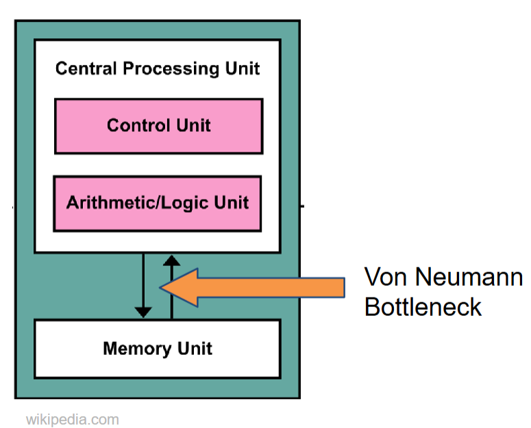
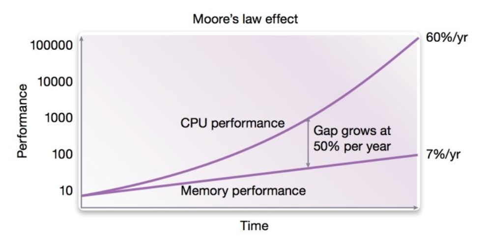
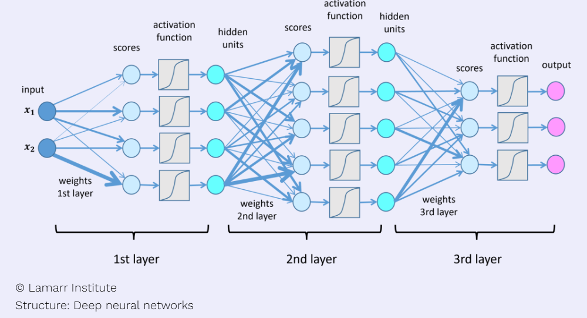

# AI Hardware and Programming
## Instructor

Notes are mainy derived from **Dr. Chen Pan's** Hardware and programming course at **UTSA**.

- Instructor Email: chen.pan@utsa.edu

## Overview

- Understanding microarchitecture of various AI hardware, parallel computing, and deep learning
- Low level (C\C++) programming for executing AI algorithms
- Bridge the gap between hardware and software in AI.

## Computational Limits in AI

AI differs from traditional sequential code in that it relies heavily on **parallelism** and processing large datasets, making operations like matrix multiplication central to tasks like training and inference. While sequential code (found in most classical microcontrollers/microcomputers) executes one instruction at a time, AI performs millions of computations simultaneously, requiring hardware like GPUs or TPUs for efficient parallel processing. AI also demands high memory bandwidth, low latency, and specialized accelerators to handle its computational intensity, exceeding the capabilities of traditional architectures designed for sequential tasks.

### The Von Neumann bottleneck

The **Von Neumann architecture** is a foundational computing model that organizes a computer into three main components: a **CPU (central processing unit)**, **memory** (for storing data and instructions), and **I/O devices**. It operates by fetching instructions from memory, decoding them, and executing them sequentially, which is known as the **fetch-decode-execute cycle**. While the Von Neumann architecture underpins most general-purpose computers, its inherent bottleneck—limited bandwidth between the CPU and memory (the "Von Neumann bottleneck")—poses challenges for AI workloads, which often require high-speed processing of massive datasets. To address this, specialized AI hardware, such as GPUs, TPUs, and neuromorphic chips, is designed to parallelize computations and overcome memory bottlenecks, enabling efficient training and inference for complex AI models. Thus, while AI builds on the principles of the Von Neumann architecture, it increasingly relies on adaptations and specialized architectures optimized for its unique demands.

### The Memory Performace Gap
The **memory performance gap** is the mismatch between CPU speed and slower memory access, creating a bottleneck for AI workloads that rely on fast data processing. AI hardware mitigates this with high-bandwidth memory (HBM), larger caches, and optimized architectures like GPUs and TPUs, which improve memory throughput and enable efficient parallel processing of large datasets.

Source: [researchgate](https://www.researchgate.net/figure/Trend-of-processing-vs-memory-performance-on-time-Hardware-parallelism-eg-in-the_fig3_329400858)

### Memory-bound vs Compute-bound

**Memory-Bound** tasks are limited by the speed of data transfer between memory and the processor, causing the CPU or GPU to wait for data. Examples include fetching large datasets or model weights in AI.

**Compute-Bound** tasks are limited by the processor's computational power, with the CPU or GPU fully utilized for calculations. Examples include matrix multiplications in deep learning.

In AI, memory-bound tasks benefit from faster memory or bandwidth, while compute-bound tasks require more powerful processors or accelerators.

## Computational View of a DNN

### Its Just Matrix Math
In deep neural networks (DNN), matrix math is the foundation for propagating data through layers, as depicted in the diagram. Each layer starts with **input features** (\( \mathbf{x}_1, \mathbf{x}_2, \dots \)) that are combined with a **weight matrix** (\( \mathbf{W} \)) to compute **scores**:

\[
\mathbf{z} = \mathbf{W} \cdot \mathbf{x} + \mathbf{b}
\]

The scores are then passed through an **activation function** \( f(\cdot) \), such as the one shown in the diagram, to introduce non-linearity:

\[
\mathbf{y} = f(\mathbf{z})
\]

The result, \( \mathbf{y} \), represents the output of **hidden units** in each layer, which then serve as inputs to the next layer. This process is repeated across multiple layers, from the **first layer** (weights, scores, and activation functions) through the **hidden layers** to the final layer, which produces the **output units**.

Each hidden layer transforms its inputs into a new representation using the same sequence: weights, scores, activation functions, and outputs. These operations are computationally intensive but highly parallelizable, making GPUs and TPUs essential for efficiently handling the large-scale computations in deep learning.

### Training the DNN
Training is the process of learning the optimal weights and biases for a DNN. It involves:

1. **Forward Pass**: Input features are propagated through the network to compute predictions.
2. **Loss Calculation**: The error between predictions and targets is measured using a loss function.
3. **Backpropagation**: Gradients of the loss with respect to the weights are calculated.
4. **Weight Update**: Weights are adjusted using an optimizer (e.g., SGD) to minimize the error.

This process repeats over many iterations (epochs) until the model converges.

### Executing the DNN (Inference) 
Inference uses the trained weights to make predictions. It involves:

1. **Forward Pass Only**: Input features propagate through the network to compute outputs.
2. **Prediction**: The final output represents the model's decision.

Unlike training, inference is faster and less computationally intensive as it skips backpropagation and weight updates.

**Key Differences**

| **Aspect**       | **Training**                       | **Inference**                    |
|-------------------|-----------------------------------|----------------------------------|
| **Purpose**       | Learn weights.                   | Make predictions.                |
| **Operations**    | Forward pass + backpropagation.  | Forward pass only.               |
| **Resource Needs**| High (GPUs/TPUs).                | Low, optimized for speed.        |
