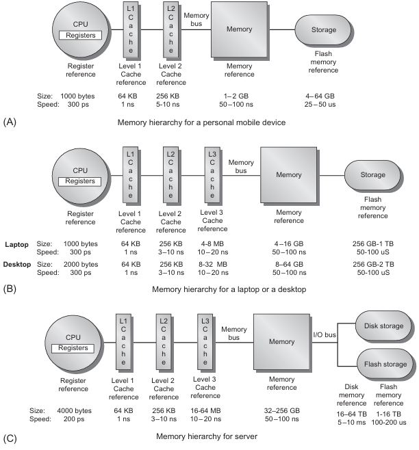

# AI Hardware and Programming
## Instructor

Notes are mainy derived from **Dr. Chen Pan's** Hardware and programming course at **UTSA**.

- Instructor Email: chen.pan@utsa.edu

## Resources

- [Computer Architecture: A Quantitative Approach 6th Edition](https://archive.org/details/computerarchitectureaquantitativeapproach6thedition/page/n11/mode/2up?view=theater)

## Overview

- Understanding microarchitecture of various AI hardware, parallel computing, and deep learning
- Low level (C\C++) programming for executing AI algorithms
- Bridge the gap between hardware and software in AI.

## Computational Limits in AI

AI differs from traditional sequential code in that it relies heavily on **parallelism** and processing large datasets, making operations like matrix multiplication central to tasks like training and inference. While sequential code (found in most classical microcontrollers/microcomputers) executes one instruction at a time, AI performs millions of computations simultaneously, requiring hardware like GPUs or TPUs for efficient parallel processing. AI also demands high memory bandwidth, low latency, and specialized accelerators to handle its computational intensity, exceeding the capabilities of traditional architectures designed for sequential tasks.

### The Von Neumann bottleneck

The **Von Neumann architecture** is a foundational computing model that organizes a computer into three main components: a **CPU (central processing unit)**, **memory** (for storing data and instructions), and **I/O devices**. It operates by fetching instructions from memory, decoding them, and executing them sequentially, which is known as the **fetch-decode-execute cycle**. While the Von Neumann architecture underpins most general-purpose computers, its inherent bottleneck—limited bandwidth between the CPU and memory (the "Von Neumann bottleneck")—poses challenges for AI workloads, which often require high-speed processing of massive datasets. To address this, specialized AI hardware, such as GPUs, TPUs, and neuromorphic chips, is designed to parallelize computations and overcome memory bottlenecks, enabling efficient training and inference for complex AI models. Thus, while AI builds on the principles of the Von Neumann architecture, it increasingly relies on adaptations and specialized architectures optimized for its unique demands.

### The Memory Performace Gap
The **memory performance gap** is the mismatch between CPU speed and slower memory access, creating a bottleneck for AI workloads that rely on fast data processing. AI hardware mitigates this with high-bandwidth memory (HBM), larger caches, and optimized architectures like GPUs and TPUs, which improve memory throughput and enable efficient parallel processing of large datasets.

Source: [researchgate](https://www.researchgate.net/figure/Trend-of-processing-vs-memory-performance-on-time-Hardware-parallelism-eg-in-the_fig3_329400858)

### Memory-bound vs Compute-bound

**Memory-Bound** tasks are limited by the speed of data transfer between memory and the processor, causing the CPU or GPU to wait for data. Examples include fetching large datasets or model weights in AI.

**Compute-Bound** tasks are limited by the processor's computational power, with the CPU or GPU fully utilized for calculations. Examples include matrix multiplications in deep learning.

In AI, memory-bound tasks benefit from faster memory or bandwidth, while compute-bound tasks require more powerful processors or accelerators.

### The Power Gap

Battery technology is not keeping up to power requirments of embedded systems. To combat this, energy harvesting alternatives like solar, RF, heat, or kinetic energy harvesting are being explored.

## Computational View of a DNN

### Its Just Matrix Math
In deep neural networks (DNN), matrix math is the foundation for propagating data through layers, as depicted in the diagram. Each layer starts with **input features** (\( \mathbf{x}_1, \mathbf{x}_2, \dots \)) that are combined with a **weight matrix** (\( \mathbf{W} \)) to compute **scores**:

\[
\mathbf{z} = \mathbf{W} \cdot \mathbf{x} + \mathbf{b}
\]

The scores are then passed through an **activation function** \( f(\cdot) \), such as the one shown in the diagram, to introduce non-linearity:

\[
\mathbf{y} = f(\mathbf{z})
\]

The result, \( \mathbf{y} \), represents the output of **hidden units** in each layer, which then serve as inputs to the next layer. This process is repeated across multiple layers, from the **first layer** (weights, scores, and activation functions) through the **hidden layers** to the final layer, which produces the **output units**.

Each hidden layer transforms its inputs into a new representation using the same sequence: weights, scores, activation functions, and outputs. These operations are computationally intensive but highly parallelizable, making GPUs and TPUs essential for efficiently handling the large-scale computations in deep learning.

### Training the DNN
Training is the process of learning the optimal weights and biases for a DNN. It involves:

1. **Forward Pass**: Input features are propagated through the network to compute predictions.
2. **Loss Calculation**: The error between predictions and targets is measured using a loss function.
3. **Backpropagation**: Gradients of the loss with respect to the weights are calculated.
4. **Weight Update**: Weights are adjusted using an optimizer (e.g., SGD) to minimize the error.

This process repeats over many iterations (epochs) until the model converges.

### Executing the DNN (Inference) 
Inference uses the trained weights to make predictions. It involves:

1. **Forward Pass Only**: Input features propagate through the network to compute outputs.
2. **Prediction**: The final output represents the model's decision.

Unlike training, inference is faster and less computationally intensive as it skips backpropagation and weight updates.

**Key Differences**

| **Aspect**       | **Training**                       | **Inference**                    |
|-------------------|-----------------------------------|----------------------------------|
| **Purpose**       | Learn weights.                   | Make predictions.                |
| **Operations**    | Forward pass + backpropagation.  | Forward pass only.               |
| **Resource Needs**| High (GPUs/TPUs).                | Low, optimized for speed.        |

---
## Computer Architecture Basics

### Instruction Sets 

RISC (Reduced Instruction Set Computing) and CISC (Complex Instruction Set Computing) are two CPU architecture approaches that impact instruction execution, power efficiency, and complexity.

| Feature         | **RISC (Reduced Instruction Set Computing)** | **CISC (Complex Instruction Set Computing)** |
|---------------|----------------------------------|----------------------------------|
| **Instruction Set** | Small, fixed-length, simple | Large, variable-length, complex |
| **Execution**  | One or few cycles per instruction | Some instructions take multiple cycles |
| **Memory Access** | Load/Store model (separate memory instructions) | Memory operations embedded in instructions |
| **Code Size** | More instructions but simpler | Fewer instructions but more complex |
| **Pipelining** | Easier to implement | More difficult due to complex decoding |
| **Power Efficiency** | More efficient, ideal for mobile and embedded devices | Higher power consumption, used in desktops and servers |
| **Examples** | ARM, RISC-V, PowerPC | x86 (Intel, AMD), IBM System/360 |

---

### Flynn's Taxonomy

Flynn's Taxonomy classifies computer architectures based on **how instructions and data are processed**. It consists of four primary categories: **SISD, SIMD, MISD, and MIMD**.

| **Category** | **Description** | **Usage Examples** |
|-------------|----------------|--------------------|
| **SISD** (Single Instruction, Single Data) | Traditional sequential execution, one instruction operates on one data at a time. | Early CPUs, simple microcontrollers |
| **SIMD** (Single Instruction, Multiple Data) | One instruction applied to multiple data elements simultaneously. | GPUs, vector processors, AI deep learning |
| **MISD** (Multiple Instruction, Single Data) | Multiple instructions process the same data stream simultaneously. Rarely used. | Fault-tolerant computing (e.g., redundant military systems) |
| **MIMD** (Multiple Instruction, Multiple Data) | Multiple processors execute different instructions on different data streams. | Multi-core CPUs, distributed computing, cloud systems |

---

### **Old vs. Real Computer Architecture**

Computing architectures can be categorized into **old (theoretical) models** and **real (practical) implementations**. Old architectures define foundational principles, while real architectures build upon them with modern enhancements.

| **Architecture Type** | **Description** | **Examples** |
|---------------------|----------------|-------------|
| **Old Architectures** | Conceptual models shaping computing principles, often with limitations in speed and memory efficiency. | Von Neumann (shared memory for data/instructions), Harvard (separate memory paths), Stack-based (operations via stack), Accumulator-based (single register for operations) |
| **Real Architectures** | Practical implementations optimizing speed, parallelism, and efficiency for real-world applications. | RISC (ARM, RISC-V), CISC (x86), VLIW (Intel Itanium), Superscalar (modern x86, ARM Cortex), Multi-core (Intel Core, AMD Ryzen) |

Modern processors often blend **Von Neumann’s model with elements of Harvard architecture** to enhance performance. Superscalar and multi-core architectures leverage parallel execution for increased computing power, making them dominant in **general-purpose computing, AI acceleration, and cloud systems**.

## Memory Hierarchy Design

---

### **Types of Memory in Computer Architecture**
Memory can be categorized into **primary, secondary, and virtual memory**, each serving different roles in a computer system.

**A. Primary Memory (Volatile)**

| **Memory Type** | **Description** | **Examples** |
|---------------|----------------|-------------|
| **Registers** | Small storage inside the CPU for immediate processing. | Program Counter (PC), Accumulator |
| **Cache Memory** | Stores frequently accessed data for faster CPU access. | L1, L2, L3 cache |
| **RAM (Random Access Memory)** | Stores currently running programs and data. | DDR4, DDR5 |

**B. Secondary Memory (Non-Volatile)**

| **Memory Type** | **Description** | **Examples** |
|---------------|----------------|-------------|
| **HDD (Hard Disk Drive)** | Magnetic storage with moving parts, slower but cheaper. | Traditional laptop HDDs |
| **SSD (Solid State Drive)** | Flash-based storage, much faster than HDDs. | NVMe SSD, SATA SSD |

**C. Virtual Memory**

| **Memory Type** | **Description** | **Examples** |
|---------------|----------------|-------------|
| **Swap Space** | Uses disk space as an extension of RAM. | Linux Swap, Windows Pagefile |
| **Paging** | Divides memory into fixed-size pages to manage virtual memory. | 4KB page size in OS |

---

### **Memory Access Methods**
| **Access Method** | **Description** | **Example** |
|-----------------|----------------|-------------|
| **Sequential Access** | Reads data in a linear order. | Magnetic tape storage |
| **Direct Access** | Jumps directly to memory locations. | Hard drives, SSDs |
| **Random Access** | Any memory cell can be accessed in constant time. | RAM, Cache |

---
### Cache Fundamentals

Modern systems bridge the processor-memory speed gap with caches. When a word is missing (a miss), a contiguous block is fetched from lower memory and stored in the cache with an identifying tag.

**Cache Organization:**

- **Set Associative:** Blocks map to a set based on their address.

    - *Direct-Mapped:* One block per set.
     - *Fully Associative:* Blocks can be placed anywhere.

**Write Strategies:**

- **Write-Through:** Updates cache and memory simultaneously.
- **Write-Back:** Updates the cache only; writes back when the block is evicted.
- **Write Buffers:** Mitigate write latency by queuing updates.

**Performance Metrics:**

- **Miss Rate:** The fraction of accesses that result in a miss, categorized as:

    - *Compulsory:* First-time accesses.
    - *Capacity:* Occur when the cache is too small.
    - *Conflict:* Happen due to set-associativity limits.

- **Average Memory Access Time (AMAT):**  
  \[
  \text{AMAT} = \text{Hit Time} + (\text{Miss Rate} \times \text{Miss Penalty})
  \]

**Key Optimizations:**

1. **Larger Block Size:** Leverages spatial locality but may increase miss penalty.
2. **Bigger Caches:** Reduces capacity misses at the cost of increased power and potentially longer hit times.
3. **Higher Associativity:** Lowers conflict misses, possibly increasing hit time.
4. **Multilevel Caches:** Combine small, fast caches (L1) with larger ones (L2/L3) for efficiency.
5. **Read Priority:** Uses write buffers to give reads precedence, reducing miss penalties.
6. **Virtual Indexing:** Avoids delays from address translation during cache indexing.

**Design Trade-Offs:**: System designs (servers, desktops, PMDs) balance these factors differently, considering performance, power, cost, and workload characteristics.

---

### **Virtual Memory**

Virtual memory is a memory management technique that allows a computer to use **more memory than physically available** by utilizing disk storage as an extension of RAM. It provides an abstraction that enables programs to operate as if they have access to a **large, contiguous block of memory**, even if the physical RAM is limited.

**How Virtual Memory Works**

1. **Paging** – The operating system divides memory into fixed-sized **pages** (e.g., 4KB) and stores inactive pages on the disk.
2. **Page Table** – Keeps track of mappings between **virtual addresses** (used by programs) and **physical addresses** (actual RAM locations).
3. **Page Faults** – When a program accesses a page that is not in RAM, the OS retrieves it from disk, causing a **performance delay**.
4. **Swap Space** – A reserved portion of disk storage where the OS stores temporarily unused memory pages.

**Benefits of Virtual Memory**

| **Feature** | **Description** |
|------------|----------------|
| **Increases Available Memory** | Programs can use more memory than the installed RAM. |
| **Memory Isolation** | Each process operates in its own memory space, preventing crashes from affecting other processes. |
| **Efficient Multitasking** | Multiple programs can run without worrying about limited RAM. |
| **Simplifies Memory Management** | Programs don’t need to manage physical memory directly. |

**Virtual Memory vs. Physical Memory**

| **Aspect** | **Virtual Memory** | **Physical Memory (RAM)** |
|-----------|------------------|--------------------|
| **Location** | Simulated in disk storage | Actual hardware memory |
| **Speed** | Slower (depends on disk speed) | Fast (nanosecond-level access) |
| **Capacity** | Larger than RAM | Limited by installed hardware |
| **Usage** | Extends available memory | Stores active processes |

**Challenges of Virtual Memory**

- **Slower Performance** – Retrieving data from disk (swap space) is much slower than accessing RAM.
- **Thrashing** – If too many pages are swapped frequently, performance degrades significantly.
- **Disk Wear** – On SSDs, excessive swapping can reduce lifespan.

Virtual memory is a key component of **modern operating systems** (Windows, Linux, macOS) and is essential for running large applications with limited physical RAM.

---

### **Memory Management in Operating Systems**
Operating systems manage memory through:

1. **Paging:** Divides memory into pages, swapping in/out as needed.
2. **Segmentation:** Divides memory into segments (code, stack, heap).
3. **Virtual Memory:** Uses disk space to extend RAM.

---

### **Emerging Nonvolatile Memory**

**NAND Flash (Floating Gate Transistor)**

- Based on floating-gate transistors, where electrons are trapped in a floating gate to store data.
- Widely used in SSDs, USB drives, and memory cards.
- **Advantages:** High density and low cost per bit.
- **Disadvantages:** Limited endurance due to charge leakage over time.

**FRAM (Ferroelectric RAM)**

- Uses a ferroelectric material (often PZT) to store data by switching polarization states.
- **Advantages:** Low power consumption, high-speed read/write, and better endurance than Flash.
- **Disadvantages:** Lower density and higher cost than Flash memory.

**PCM (Phase-Change Memory)**

- Utilizes phase-change material (GST - Germanium-Antimony-Tellurium) that switches between amorphous and crystalline states to represent data.
- **Advantages:** Faster than Flash, better endurance, and potential for high-density storage.
- **Disadvantages:** High write energy and material degradation over repeated cycles.

**STT-RAM (Spin-Transfer Torque RAM)**

- Based on magnetic tunnel junctions, where data is stored using the spin of electrons.
- **Advantages:** High speed, non-volatility, and low power consumption.
- **Disadvantages:** Higher cost and fabrication complexity.

**RRAM (Resistive RAM)**

- Stores data by changing the resistance of a material through the movement of oxygen vacancies.
- **Advantages:** Low power, fast switching speed, and scalability.
- **Disadvantages:** Variability in resistance states and endurance issues.

Each of these memory technologies offers trade-offs in speed, endurance, power consumption, and scalability, making them suitable for different applications.

## Instruction-Level Parallelism (ILP)

### **Overview**
Since 1985, processors have used pipelining to improve performance by overlapping the execution of instructions. This overlapping is called **instruction-level parallelism (ILP)**, as multiple instructions can be executed in parallel. This chapter explores various techniques to enhance ILP beyond basic pipelining.

To understand ILP, it is essential to first understand **basic pipelining**, a fundamental technique used to improve CPU performance.

### **Basic Pipelining**
A **pipeline** is a sequence of processing stages where each stage completes a part of an instruction. Instead of waiting for one instruction to fully execute before starting the next, a processor with a pipeline allows multiple instructions to be **in different stages of execution simultaneously**.

A classic **5-stage pipeline** consists of:

1. **Instruction Fetch (IF)**: The processor retrieves the next instruction from memory.

2. **Instruction Decode (ID)**: The instruction is decoded, and the control unit determines what needs to be done.

3. **Execute (EX)**: The operation is performed using the Arithmetic Logic Unit (ALU) or another relevant execution unit.

4. **Memory Access (MEM)**: If the instruction involves memory (load/store), this stage accesses memory.

5. **Write Back (WB)**: The result is written back to registers.

**How pipelining speeds this up:**

Without pipelining, instructions execute sequentially, meaning each instruction must complete all five stages before the next begins. With pipelining, multiple instructions are in different stages at the same time, improving throughput. In an ideal scenario, a 5-stage pipeline can **complete one instruction per cycle** after the pipeline is filled.

For example, if each stage takes 1 cycle, executing 5 instructions sequentially would take **5 × 5 = 25 cycles** without pipelining. With pipelining, once the pipeline is full, one instruction completes every cycle, leading to execution in **9 cycles** instead of 25.

**Pipeline limitations:**

Despite its benefits, pipelining is **not** always perfect. Three main types of hazards can **stall the pipeline**, reducing efficiency:

- **Structural Hazards**: Occur when hardware resources (e.g., memory, ALUs) are insufficient to execute multiple instructions in parallel.

- **Data Hazards**: Occur when one instruction depends on the result of a previous instruction still in the pipeline.

- **Control Hazards**: Occur when the pipeline does not know which instruction to fetch next due to a branch.

---

### ILP Techniques

### **Basic Block ILP**

- A **basic block** is a sequence of instructions with **no internal branches**.
- The **branch frequency** in MIPS programs is typically **15%-25%**, limiting parallelism within a basic block.

### **Loop-Level Parallelism**

- **Parallelism across loop iterations** is more significant than within basic blocks.
- Example: Adding two arrays using a loop allows independent iterations to execute in parallel.
- **Loop unrolling** (either statically by the compiler or dynamically by hardware) increases ILP.

### **SIMD and Vector Processing**

- **Single Instruction, Multiple Data (SIMD)** exploits **data-level parallelism** by processing multiple data items simultaneously.
- **Vector processors** execute entire vectors of data in parallel, reducing instruction count.

---

## Dependences and Hazards in ILP

### **Data Dependences**
Data dependences determine whether instructions can be executed in parallel. There are three types:

1. **True Data Dependence (RAW - Read After Write)**  
   - Instruction **j** reads a value produced by instruction **i**.
   - **Must be preserved** to ensure correct results.

2. **Name Dependences (False Dependences)**
   - **Antidependence (WAR - Write After Read)**: **j** writes to a register before **i** reads it.
   - **Output Dependence (WAW - Write After Write)**: Both **i** and **j** write to the same register.
   - **Register Renaming** resolves name dependences.

3. **Control Dependences**
   - Determine execution order based on **branch conditions**.
   - **Preserving control dependences ensures correct program behavior**.

### **Data Hazards**
Hazards occur when dependent instructions overlap incorrectly:

- **RAW (Read After Write)** → Data not yet written before being read.
- **WAW (Write After Write)** → Writes occur in the wrong order.
- **WAR (Write After Read)** → Read occurs after a new write, leading to incorrect results.

### **Control Hazards**
- Occur due to **branch instructions**.
- Solutions:
  - **Branch prediction**
  - **Speculation (executing instructions before certainty of need)**

---

## Handling ILP Constraints

### **Speculation**
- **Hardware speculation** executes instructions before branches are resolved, **undoing incorrect execution if necessary**.
- **Software speculation** (compiler-based) reorders instructions assuming a likely branch outcome.

### **Summary**
- **ILP exploits instruction execution overlap** to improve performance.
- **Dependences and hazards limit ILP**, requiring **pipeline optimizations**.
- **Loop unrolling, SIMD, and speculation** improve ILP.
- **Modern processors use a mix of dynamic and static ILP approaches**.

Future processors must balance **ILP and thread-level parallelism** for optimal performance.
