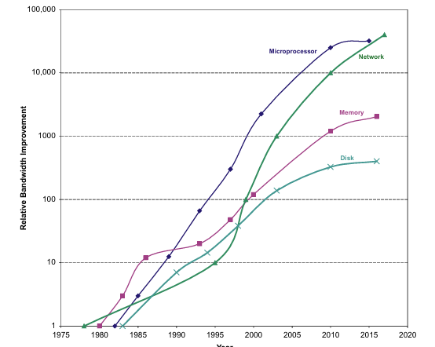

# AI Hardware Overview
## Instructor

Notes are mainy derived from **Dr. Chen Pan's** Hardware and programming course at **UTSA**.

- Instructor Email: chen.pan@utsa.edu

## Resources

- [Computer Architecture: A Quantitative Approach 6th Edition](https://archive.org/details/computerarchitectureaquantitativeapproach6thedition/page/n11/mode/2up?view=theater)

## Overview

- Understanding microarchitecture of various AI hardware, parallel computing, and deep learning
- Low level (C\C++) programming for executing AI algorithms
- Bridge the gap between hardware and software in AI.

## Computational Limits in AI

AI differs from traditional sequential code in that it relies heavily on **parallelism** and processing large datasets, making operations like matrix multiplication central to tasks like training and inference. While sequential code (found in most classical microcontrollers/microcomputers) executes one instruction at a time, AI performs millions of computations simultaneously, requiring hardware like GPUs or TPUs for efficient parallel processing. AI also demands high memory bandwidth, low latency, and specialized accelerators to handle its computational intensity, exceeding the capabilities of traditional architectures designed for sequential tasks.

### The Von Neumann bottleneck

The **Von Neumann architecture** is a foundational computing model that organizes a computer into three main components: a **CPU (central processing unit)**, **memory** (for storing data and instructions), and **I/O devices**. It operates by fetching instructions from memory, decoding them, and executing them sequentially, which is known as the **fetch-decode-execute cycle**. While the Von Neumann architecture underpins most general-purpose computers, its inherent bottleneck—limited bandwidth between the CPU and memory (the "Von Neumann bottleneck")—poses challenges for AI workloads, which often require high-speed processing of massive datasets. To address this, specialized AI hardware, such as GPUs, TPUs, and neuromorphic chips, is designed to parallelize computations and overcome memory bottlenecks, enabling efficient training and inference for complex AI models. Thus, while AI builds on the principles of the Von Neumann architecture, it increasingly relies on adaptations and specialized architectures optimized for its unique demands.

### The Memory Performace Gap
The **memory performance gap** is the mismatch between CPU speed and slower memory access, creating a bottleneck for AI workloads that rely on fast data processing. AI hardware mitigates this with high-bandwidth memory (HBM), larger caches, and optimized architectures like GPUs and TPUs, which improve memory throughput and enable efficient parallel processing of large datasets.

Source: [researchgate](https://www.researchgate.net/figure/Trend-of-processing-vs-memory-performance-on-time-Hardware-parallelism-eg-in-the_fig3_329400858)

### Memory-bound vs Compute-bound

**Memory-Bound** tasks are limited by the speed of data transfer between memory and the processor, causing the CPU or GPU to wait for data. Examples include fetching large datasets or model weights in AI.

**Compute-Bound** tasks are limited by the processor's computational power, with the CPU or GPU fully utilized for calculations. Examples include matrix multiplications in deep learning.

In AI, memory-bound tasks benefit from faster memory or bandwidth, while compute-bound tasks require more powerful processors or accelerators.

### The Power Gap

Battery technology is not keeping up to power requirments of embedded systems. To combat this, energy harvesting alternatives like solar, RF, heat, or kinetic energy harvesting are being explored.

---

### Performance Trends: Bandwidth Over Latency

Modern AI and computing workloads are increasingly **bandwidth-bound rather than latency-bound**. While **bandwidth improvements have scaled exponentially (400–32,000×)**, **latency improvements have been much slower (8–91×)**. This discrepancy requires **efficient data movement strategies** in hardware design.

To address this, modern AI architectures emphasize:

- **Parallelism**: Increasing the number of processing units (e.g., GPUs, TPUs, multi-core CPUs).
- **Memory Hierarchies**: Using multi-level caches and **HBM** to reduce memory access delays.
- **Interconnect Optimization**: Using **high-speed data buses, PCIe, and NVLink** to improve bandwidth efficiency.
- **Data Locality Strategies**: Prefetching and reusing data efficiently to minimize slow memory accesses.

---

### Cost vs. Energy Efficiency in AI Hardware

In large-scale AI computing, **energy efficiency is now as important as performance**. As **operational costs (power and cooling) exceed hardware costs in cloud data centers**, AI accelerators must balance **power efficiency with computational throughput**. Key trends include:

- **Energy-efficient accelerators**: TPUs and domain-specific processors reduce redundant computation.
- **Dark Silicon Awareness**: Modern chips often have **unused transistors** due to power constraints, requiring careful workload distribution.
- **Performance per Watt**: AI hardware is increasingly evaluated based on **tasks per joule** rather than raw FLOPS.

---

## Computer Architecture Basics

### Instruction Sets 

RISC (Reduced Instruction Set Computing) and CISC (Complex Instruction Set Computing) are two CPU architecture approaches that impact instruction execution, power efficiency, and complexity.

| Feature         | **RISC (Reduced Instruction Set Computing)** | **CISC (Complex Instruction Set Computing)** |
|---------------|----------------------------------|----------------------------------|
| **Instruction Set** | Small, fixed-length, simple | Large, variable-length, complex |
| **Execution**  | One or few cycles per instruction | Some instructions take multiple cycles |
| **Memory Access** | Load/Store model (separate memory instructions) | Memory operations embedded in instructions |
| **Code Size** | More instructions but simpler | Fewer instructions but more complex |
| **Pipelining** | Easier to implement | More difficult due to complex decoding |
| **Power Efficiency** | More efficient, ideal for mobile and embedded devices | Higher power consumption, used in desktops and servers |
| **Examples** | ARM, RISC-V, PowerPC | x86 (Intel, AMD), IBM System/360 |

---

### **Old vs. Real Computer Architecture**

Computing architectures can be categorized into **old (theoretical) models** and **real (practical) implementations**. Old architectures define foundational principles, while real architectures build upon them with modern enhancements.

| **Architecture Type** | **Description** | **Examples** |
|---------------------|----------------|-------------|
| **Old Architectures** | Conceptual models shaping computing principles, often with limitations in speed and memory efficiency. | Von Neumann (shared memory for data/instructions), Harvard (separate memory paths), Stack-based (operations via stack), Accumulator-based (single register for operations) |
| **Real Architectures** | Practical implementations optimizing speed, parallelism, and efficiency for real-world applications. | RISC (ARM, RISC-V), CISC (x86), VLIW (Intel Itanium), Superscalar (modern x86, ARM Cortex), Multi-core (Intel Core, AMD Ryzen) |

Modern processors often blend **Von Neumann’s model with elements of Harvard architecture** to enhance performance. Superscalar and multi-core architectures leverage parallel execution for increased computing power, making them dominant in **general-purpose computing, AI acceleration, and cloud systems**.

---

### **Parallel Architecture**

[Parallel architecture](parallelism.md) is a computer system design that enables multiple processors or computing units to execute tasks simultaneously, improving speed and efficiency. It is essential for AI, big data, and modern computing, as workloads like deep learning, graphics processing, and cloud computing require massive parallelism to handle complex computations efficiently. With the slowdown of Moore’s Law, parallel processing is the key to scaling performance while maintaining energy efficiency. For a deep dive on this subject travel to [Parallel architecture](parallelism.md)

---

## Quantitative Principles of Computer Design

### Take Advantage of Parallelism
[Parallelism](parallelism.md) is a key strategy for improving computing performance. It can be leveraged at multiple levels:

- **System-Level Parallelism**: Servers use multiple processors and storage devices to handle workloads efficiently.
- **Instruction-Level Parallelism (ILP)**: Techniques such as pipelining improve execution speed by overlapping instruction execution.
- **Data-Level Parallelism (DLP)**: Vector processing and SIMD instructions enable faster computations in AI and multimedia applications.

### Principle of Locality
Programs tend to reuse recently accessed data and instructions. This is classified into:

- **Temporal Locality**: Frequently used data is likely to be accessed soon.
- **Spatial Locality**: Data stored near recently accessed addresses is likely to be used.
Optimizing memory hierarchies and cache design takes advantage of these principles to improve performance.

### Focus on the Common Case
Prioritizing optimizations for the most frequent operations leads to greater overall performance gains. Examples include:

- **Optimizing instruction fetch and decode units** (used more often than multipliers).
- **Prioritizing memory accesses over rare operations** to enhance speed.

### Amdahl’s Law
Amdahl’s Law quantifies the potential speedup of a system by optimizing a portion of its execution. The formula:

\[
Speedup = \frac{1}{(1 - Fraction_{enhanced}) + \frac{Fraction_{enhanced}}{Speedup_{enhanced}}}
\]

Illustrates diminishing returns—speedup is limited by the fraction of time the enhancement can be utilized.

### The Processor Performance Equation
Performance depends on three key factors:

\[
CPU\ Time = Instruction\ Count \times Cycles\ per\ Instruction \times Clock\ Cycle\ Time
\]

- **Clock Cycle Time**: Determined by hardware and fabrication technology.
- **Cycles per Instruction (CPI)**: Affected by instruction set and microarchitecture.
- **Instruction Count**: Influenced by compiler optimizations and ISA efficiency.

Optimizing across these dimensions ensures efficient and high-performance computing systems.

## Memory Hierarchy Design

Computers use a [memory hierarchy](memory.md) to balance speed and cost, with fast, small caches close to the processor and slower, larger memory further away. Since accessing main memory is slow, cache optimization techniques like loop blocking, prefetching, and associativity improvements help keep frequently used data nearby, reducing delays. Understanding how caches work and how to optimize memory access is essential for improving overall system performance, especially in tasks like matrix multiplication, AI workloads, and high-performance computing. For a deep dive visit: [Memory Hierarchy Design](memory.md)