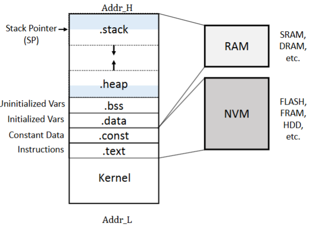

# Memory Hierarchy Design

## Memory Hierarchy Basics

 


 

Modern computing systems rely on **memory hierarchies** to bridge the gap between fast processors and slower main memory. When a requested word is not found in a cache (**cache miss**), the system fetches it from a lower-level memory, often bringing in an entire block due to **spatial locality**. Each cache block includes a **tag** to identify its memory address.

### Cache Placement Strategies:
1. **Direct-Mapped Cache** – Each block maps to exactly one location.
2. **Fully Associative Cache** – Blocks can be placed anywhere in the cache.
3. **Set-Associative Cache** – Blocks map to a limited number of locations (n-way set associativity).

### Cache Write Strategies:
- **Write-Through** – Data is written to both the cache and main memory simultaneously.
- **Write-Back** – Data is written to the cache first and updated in main memory later, improving efficiency.

### Cache Miss Classification (3 Cs Model):
1. **Compulsory Misses** – Occur when data is accessed for the first time.
2. **Capacity Misses** – Happen when the cache cannot hold all necessary data.
3. **Conflict Misses** – Result from poor cache placement, causing unnecessary evictions.

### Optimizing Cache Performance:
- **Larger Block Sizes** reduce compulsory misses but may increase miss penalties.
- **Increasing Cache Size** minimizes capacity misses at the cost of increased access time.
- **Higher Associativity** reduces conflict misses but can increase complexity and power consumption.
- **Multilevel Caches** balance speed and capacity (e.g., L1, L2, L3 caches).

### Average Memory Access Time (AMAT):
A key metric for evaluating memory hierarchy performance:

\[
\text{AMAT} = \text{Hit Time} + (\text{Miss Rate} \times \text{Miss Penalty})
\]

Optimizations such as **multithreading and latency hiding** help mitigate cache misses by overlapping memory accesses with computation.

---


## **Types of Memory in Computer Architecture**
Memory in a computer system is structured into **primary, secondary, and virtual memory**, each serving different roles in performance and storage hierarchy.

### **A. Primary Memory (Volatile)**
This memory type directly supports the CPU, ensuring fast access for ongoing computations.

| **Memory Type**    | **Description**                                        | **Examples**        |
|--------------------|--------------------------------------------------------|---------------------|
| **Registers**      | Small storage inside the CPU for immediate execution.  | Program Counter (PC), Accumulator |
| **Cache Memory**   | Stores frequently accessed data for faster CPU access. | L1, L2, L3 cache   |
| **RAM (Random Access Memory)** | Stores currently running programs and data. | DDR4, DDR5 |

### **B. Secondary Memory (Non-Volatile)**
Used for **long-term data storage** and retains data even when the power is off.

| **Memory Type**   | **Description**                                   | **Examples**        |
|-------------------|-------------------------------------------------|---------------------|
| **HDD (Hard Disk Drive)** | Magnetic storage, slower but cost-effective. | Traditional laptop HDDs |
| **SSD (Solid State Drive)** | Flash-based storage, much faster than HDDs. | NVMe SSD, SATA SSD |
| **Flash Memory**  | Non-volatile, used in portable devices and SSDs. | USB drives, SD cards |

### **C. Virtual Memory**

| **Memory Type**   | **Description**                                  | **Examples**        |
|-------------------|------------------------------------------------|---------------------|
| **Swap Space**    | Uses disk storage as an extension of RAM.      | Linux Swap, Windows Pagefile |
| **Paging**        | Divides memory into fixed-size pages for management. | 4KB page size in OS |


Virtual memory extends **RAM capacity** by using a portion of disk storage as an extension, allowing the system to handle **larger workloads** than physical memory alone. It functions by treating **physical memory as a cache** for secondary storage, moving data between the two as needed. This process relies on **paging**, where memory is divided into fixed-size pages, and a **Translation Lookaside Buffer (TLB)** caches page table entries to speed up address translation.  

Beyond extending memory, virtual memory also enhances **process isolation and security** by providing each program with its own virtual address space, preventing direct access to other processes’ memory. **Virtual Machines (VMs)** take this further by running entire operating systems within isolated environments, managed by a **Virtual Machine Monitor (VMM)** or **hypervisor**. VMs improve **security, system reliability, and hardware utilization**, making them essential for **cloud computing and server virtualization**.  

Modern processors optimize virtual memory and VM performance through **hardware-assisted virtualization**, such as Intel VT-x and AMD-V, which reduce the overhead of managing multiple virtual address spaces. Additionally, techniques like **nested page tables** and **direct memory access (DMA) virtualization** enhance efficiency in handling virtualized workloads.



Figure above shows a process memory layout, which is managed by virtual memory. It allows the CPU to access a continuous address space, even if data is stored across RAM (volatile) and NVM (non-volatile). *Source: Dr. Chen Pan UTSA*

  
---

## **Memory Access Methods**
Different memory technologies use specific access methods to retrieve data efficiently.

| **Access Method**    | **Description**                                 | **Examples**      |
|---------------------|---------------------------------------------|------------------|
| **Sequential Access** | Reads data in a linear order.              | Magnetic tape storage |
| **Direct Access**    | Jumps directly to memory locations.        | HDDs, SSDs       |
| **Random Access**   | Any memory cell can be accessed instantly.  | RAM, Cache       |

---

## **Memory Technology**

### **1. Basic Memory Technologies**
- **SRAM (Static RAM)** – Fastest, used in **CPU caches (L1, L2, L3)**, but expensive.
- **DRAM (Dynamic RAM)** – Main memory, slower than SRAM but cheaper and denser.
- **Flash Memory** – A type of **EEPROM**, Non-volatile, used in SSDs and embedded systems.

In DRAM, the information is stored in a capacitor that holds a charge representing a bit of data. However, reading the data from the capacitor causes it to discharge, and since the charge leaks over time, the data is lost when read and must be rewritten. This is why DRAM requires periodic refreshing to maintain the data. In contrast, SRAM stores data in a flip-flop made of transistors, which does not lose its information when read. SRAM does not require refreshing and is faster than DRAM as a result.

.svg.png)
*A six-transistor (6T) CMOS SRAM cell. WL: word line. BL: bit line. Realize how complex a single cell is compared to a DRAM cell below. Source: Public Domain, https://commons.wikimedia.org/w/index.php?curid=5771850*


*A 4X4 DRAM array, realize how a single DRAM cell has only one transistor and one capacitor. Source: Dynamic random-access memory Wikipedia by JürgenZ*

### **2. Advanced DRAM Technologies**
- **SDRAM (Synchronous DRAM):** The foundation of modern memory, synchronized with the system clock for predictable, efficient data access.
- **DDR (Double Data Rate) SDRAM:** Transfers data on both rising and falling clock edges, doubling bandwidth over SDRAM. Newer generations (DDR2–DDR5) improve speed, efficiency, and capacity. Essential for CPUs in desktops, laptops, and servers, balancing speed and cost.
- **GDDR (Graphics DRAM):**  Optimized for GPUs with wider buses (32-bit), higher clock rates, and direct board soldering for 2–5× DDR3 bandwidth. Critical for gaming, AI, and high-speed graphics tasks needing rapid memory access.
- **HBM (High Bandwidth Memory):** Stacks DRAM layers with an ultra-wide bus for extreme bandwidth and low power consumption. Used in AI, supercomputers, and high-end GPUs where traditional memory isn’t fast enough.


*Source: J. L. Hennessy and D. A. Patterson, Computer Architecture: A Quantitative Approach, 6th ed. Morgan Kaufmann, 2017.*

### **3. Memory Technology Optimizations**
To improve performance, modern computers use a **memory hierarchy** with the following strategies:

1. **Larger Cache Sizes** – Increases data retention, reducing main memory accesses.
2. **Higher Associativity** – Reduces **cache misses** by allowing more flexible data placement.
3. **Multilevel Caches (L1, L2, L3)** – Keeps frequently used data **closer to the processor**.
4. **Burst Transfers and Prefetching** – Reduces **DRAM latency** by pre-loading data.
5. **Banked & Interleaved DRAM** – Enables **parallel memory accesses**, increasing efficiency.
6. **Stacked Memory (HBM, 3D DRAM)** – Reduces travel distances for **lower latency and higher bandwidth**.

---

## **Memory Reliability and Error Correction**
Memory failures are mitigated through **Error Correction Codes (ECC)** and redundancy techniques.

| **Error Handling Method** | **Description** |
|------------------------|--------------------------------|
| **Parity Checking**    | Detects single-bit errors but cannot correct them. |
| **ECC (Error Correction Code)** | Detects and fixes **single-bit errors**. |
| **Chipkill Technology** | Used in data centers; recovers from complete **memory chip failure**. |

In large-scale computing (e.g., **cloud servers, data centers**), **Chipkill and ECC memory** are essential to ensure high **data integrity and system stability**.

---

## **Compiler Optimizations to Reduce Cache Miss Rate**

Efficient cache utilization can significantly improve performance without requiring hardware modifications. The following compiler optimizations reduce cache miss rates by improving **spatial** and **temporal locality**.

---

### **1. Loop Interchange (Improves Spatial Locality)**
Nested loops may access data in an inefficient order, leading to **cache misses**. **Loop interchange** reorders loops so that memory accesses follow a sequential pattern, maximizing cache utilization.

**Example:**
```c
/* Before - Poor spatial locality (column-major order) */
for (j = 0; j < 100; j++)
    for (i = 0; i < 5000; i++)
        x[i][j] = 2 * x[i][j];

/* After - Optimized for row-major order */
for (i = 0; i < 5000; i++)
    for (j = 0; j < 100; j++)
        x[i][j] = 2 * x[i][j];
```
- The original version jumps through memory with a **stride of 100**, causing frequent **cache misses**.
- The optimized version accesses **adjacent elements**, improving **spatial locality**.

---

### **2. Blocking (Improves Temporal Locality)**
**Blocking** reduces cache misses by ensuring frequently accessed data remains in the cache before being replaced.

**Example: Naïve Matrix Multiplication (High Cache Misses)**
```c
/* Standard matrix multiplication */
for (i = 0; i < N; i++)
    for (j = 0; j < N; j++) {
        r = 0;
        for (k = 0; k < N; k++)
            r += y[i][k] * z[k][j];
        x[i][j] = r;
    }
```
- The above implementation results in **poor cache efficiency** because:
  - It reads an entire **N × N matrix `z`** for every row of `x` and `y`.
  - Cache capacity is exceeded, leading to frequent **capacity misses**.

**Optimized Matrix Multiplication Using Blocking**
```c
/* Optimized using blocking */
for (jj = 0; jj < N; jj += B)
    for (kk = 0; kk < N; kk += B)
        for (i = 0; i < N; i++)
            for (j = jj; j < min(jj + B, N); j++) {
                r = 0;
                for (k = kk; k < min(kk + B, N); k++)
                    r += y[i][k] * z[k][j];
                x[i][j] += r;
            }
```
- **Why is this better?**
  - Instead of working on full rows/columns, we **process smaller blocks that fit in the cache**, reducing memory accesses.
  - This leverages **both spatial and temporal locality**.

---

### **Prioritization for Matrix Multiplication Analysis**
To analyze the given matrix multiplication problem efficiently, we should prioritize the following steps:

1. **Determine Matrix Dimensions**  

    - Identify the size of `C = A × B`, ensuring `C` has dimensions `(m × n)`.
    - Establish constraints for `l` based on memory availability.

2. **Memory Allocation Constraints**  
   
    - Calculate the maximum possible `l` using memory constraints.
    - Convert results to dimensions for `A`, `B`, and `C` considering 16-bit integer storage.

3. **Compute Memory Access Time**  
   
    - Analyze cache behavior given **fully associative cache** with **32B cache lines**.
    - Compute cache hit/miss penalties using **Least Recently Used (LRU) replacement**.
    - Derive total **cycles required** for the matrix multiplication.

4. **Optimize for Cache Efficiency**  
   
    - Identify poor cache utilization patterns in the given loop.
    - Implement **loop interchange** or **blocking** to improve locality.
    - Calculate performance improvement by reducing cache misses.

5. **Analyze Post-Computational Random Access**  
   
    - Compute the **average memory access time** when randomly accessing `A`, `B`, and `C`.
    - Compare this with structured access times to draw conclusions on **cache efficiency**.

6. **Final Conclusion**  
   
    - Summarize findings on how **memory hierarchy impacts performance**.
    - Justify why **locality-aware optimizations** significantly improve execution speed.

By following this structured prioritization, we can effectively **minimize memory latency and improve computational efficiency** for matrix multiplication.
