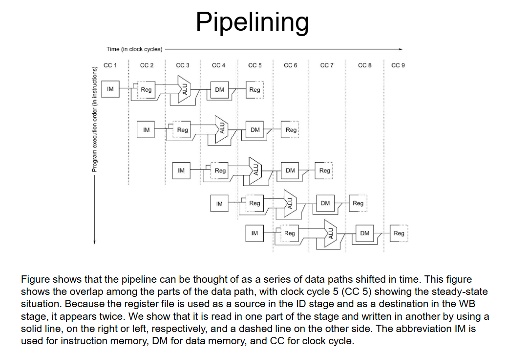
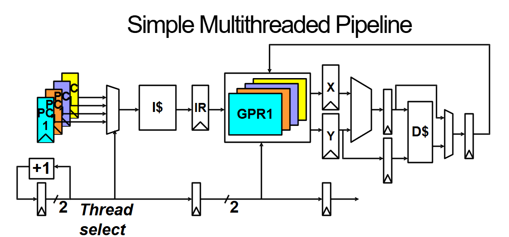
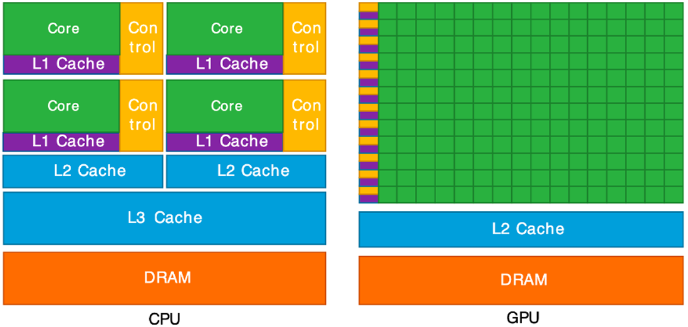
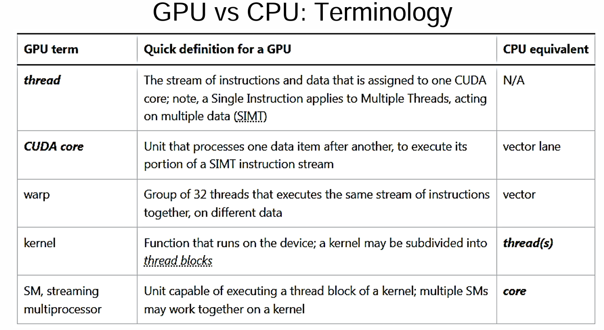
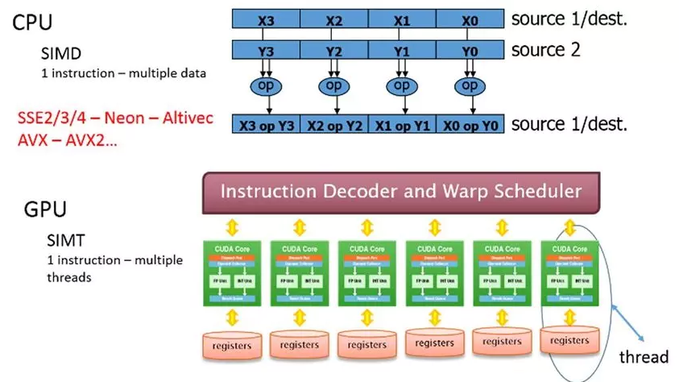
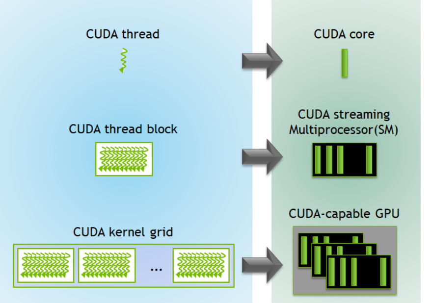
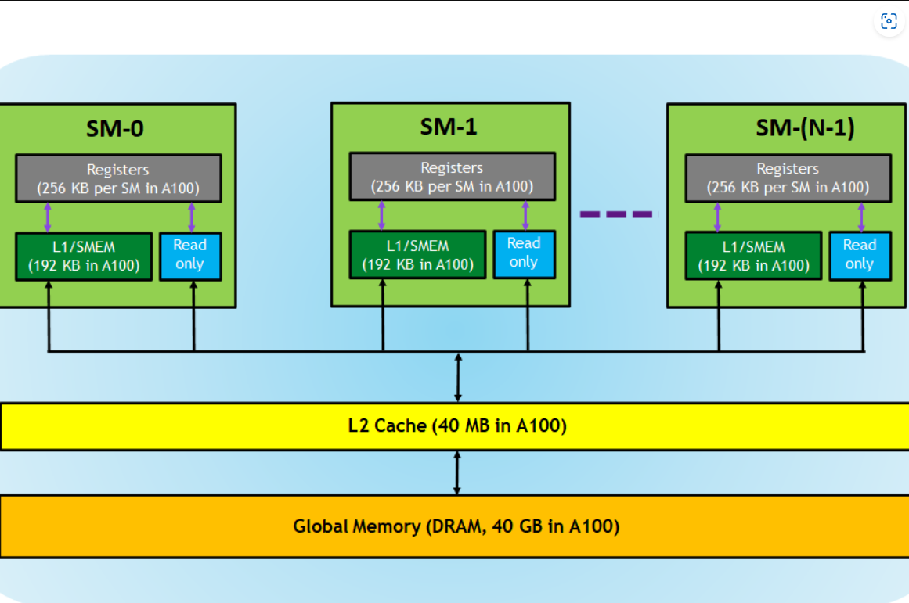
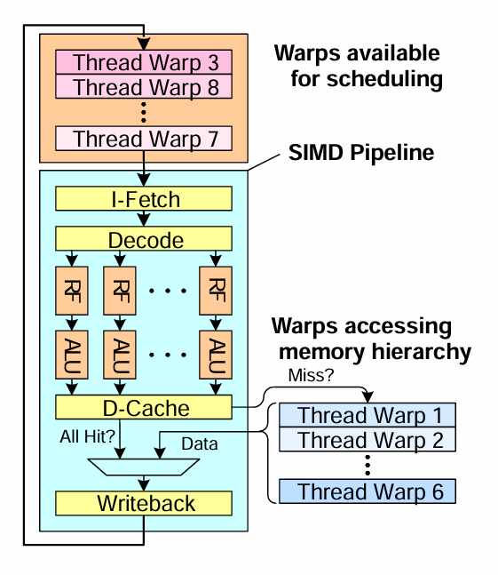
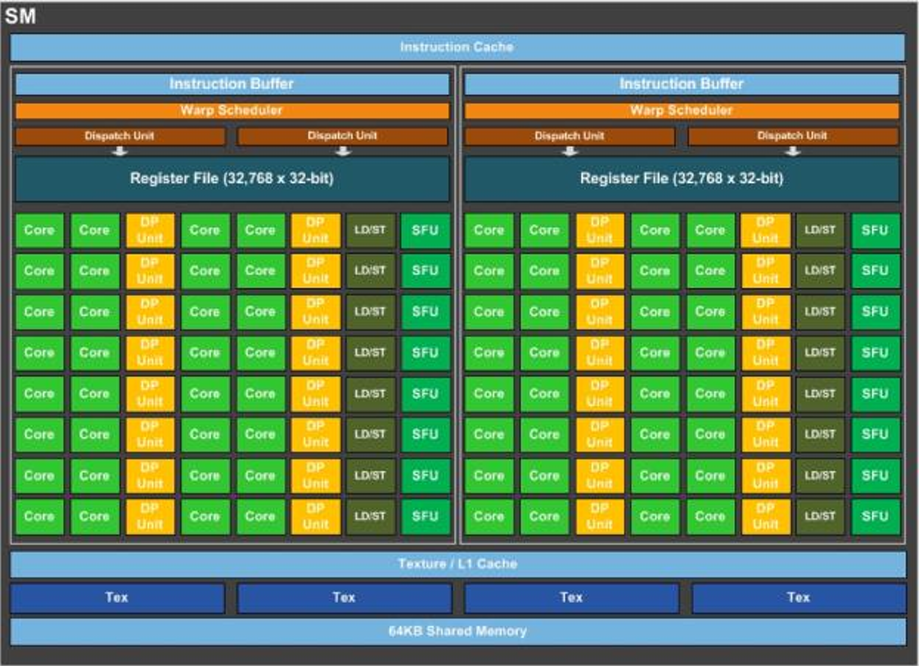

# Parallel Computing

**Parallel architecture** refers to a computer system design that allows multiple processors or computing units to execute tasks concurrently. This approach improves performance, efficiency, and scalability by leveraging parallelism at several levels.

**Parallelism** in computing is the practice of executing multiple computations simultaneously by dividing work into smaller sub-tasks that can be processed independently. Modern systems use various forms of parallelism to meet the demands of complex and data‐intensive applications.

## Flynn’s Taxonomy of Parallel Architectures

Flynn’s Taxonomy classifies computer architectures based on how instructions and data are processed.


| **Category** | **Description** | **Usage Examples** |
|--------------|-----------------|--------------------|
| **SISD** (Single Instruction, Single Data) | Traditional sequential processing: one instruction operates on one data element at a time. | Early CPUs, simple microcontrollers |
| **SIMD** (Single Instruction, Multiple Data) | A single instruction is simultaneously applied to multiple data elements. | GPUs, vector processors, deep learning accelerators |
| **MISD** (Multiple Instruction, Single Data) | Multiple instructions process the same data stream. This model is rarely used in practice. | Fault-tolerant systems in critical applications (e.g., redundant military systems) |
| **MIMD** (Multiple Instruction, Multiple Data) | Different processors execute different instructions on separate data streams. | Multi-core CPUs, distributed computing, cloud systems |

Modern systems often blend characteristics of SIMD and MIMD, creating **hybrid architectures** that balance flexibility with high throughput. For example, GPUs integrate both data-level and thread-level parallelism to handle a variety of workloads.

## **Types of Parallelism**  

Parallelism can be categorized into different types based on how tasks are executed. Two fundamental types are **temporal parallelism (pipelining)** and **spatial parallelism**.  

### **Temporal Parallelism (Pipelining)**  
Temporal parallelism divides a task into sequential stages that can be overlapped, improving overall throughput. A great way to understand this is through a **cookie-baking process**:  

- Without parallelism: You roll out the dough (5 min) and then bake it (15 min), taking **20 minutes per batch**.  
- With pipelining: While the first batch is baking, you start preparing the next one. This doesn’t change the time required for a single batch but allows **continuous production**, reducing the wait time between finished batches.  

This analogy mirrors how CPUs execute instructions in a **pipeline**, where different stages (fetch, decode, execute, etc.) are processing different instructions simultaneously. Just like a baker needs **separate trays** to avoid mixing batches, processors use **pipeline registers** to store intermediate data. While the total time for the first output remains the same, **subsequent results come out much faster**, boosting overall performance.  


*Source: Dr. Chen Pan (UTSA)*

### **Spatial Parallelism**  
Spatial parallelism, on the other hand, involves executing tasks **simultaneously** using separate hardware units. Instead of working in stages, tasks run in parallel from the start.  

Imagine Ben has a helper and an extra oven. Now, **two batches** can be processed at the same time—effectively **doubling throughput** while keeping the time per batch unchanged.  

This type of parallelism is commonly seen in:

- **Multithreaded systems:** Where independent threads run on separate cores.
- **GPU architectures:** Which execute many threads in parallel using a SIMT (Single Instruction, Multiple Threads) model.

## Types of Processing
**Processing** refers to how a CPU executes instructions.

### Scalar Processing
A **scalar** CPU executes one instruction at a time. This category includes **pipelined processors**, which improve instruction throughput by overlapping the execution of multiple instructions through different stages of processing. However, despite the efficiency gains from pipelining, a scalar processor fundamentally handles only one operation per cycle.

### Vector Processing
A **vector** CPU also executes one instruction at a time, but it operates on **vector data** instead of single scalar values. This allows the processor to perform computations on multiple elements simultaneously. For example, the instruction:

```
X[0:7] + Y[0:7]
```
performs element-wise addition on two vectors of eight elements in a single operation. On a scalar processor, this would require eight separate instructions to achieve the same result.

### Superscalar Processing
A **superscalar** CPU is capable of executing multiple **unrelated** instructions simultaneously. It achieves this by having multiple execution units that can work in parallel. For example, a superscalar processor could execute the following two instructions concurrently:

```
ADD X + Y
MUL W * Z
```
This parallelism increases overall instruction throughput and efficiency, making superscalar processors well-suited for high-performance computing applications.

---

## Understanding Instruction-Level Parallelism (ILP)

### What is ILP?
Instruction-Level Parallelism (ILP) refers to the extent to which multiple instructions in a program can be executed simultaneously. ILP is an **attribute of the program**, meaning it depends on the nature of the instructions, the **Instruction Set Architecture (ISA)**, and how well the **compiler** organizes the code for parallel execution.

### ILP vs. IPC
While ILP describes the **potential parallelism** within a program, **Instructions Per Cycle (IPC)** measures the **actual** instruction throughput of a processor. The key differences are:

- **ILP is theoretical**: It represents the maximum parallelism that can be extracted from a program.
- **IPC is practical**: It depends on the actual hardware implementation and various runtime factors.
- **ILP sets an upper bound on IPC**, but the achievable IPC is limited by hardware constraints such as instruction latencies, cache behavior, and processor execution capabilities.

### Hazards and Dependencies
To effectively exploit ILP, we must understand various **hazards** (situations that prevent parallel execution). The three main types of dependencies that cause hazards are:

#### 1. Data Dependencies
Data dependencies occur when an instruction depends on the result of a previous instruction. There are three types:

- **True Dependency (Read After Write, RAW)**: The second instruction needs data produced by the first instruction.
  
```assembly
ADD R1, R2, R3   # R1 = R2 + R3  
SUB R4, R1, R5   # R4 = R1 - R5 (Depends on ADD result)
```

- **Anti Dependency (Write After Read, WAR)**: The second instruction writes to a register before the first instruction reads it.
  
```assembly
SUB R1, R2, R3   # Reads R2
ADD R2, R4, R5   # Writes to R2 before SUB reads it
```

- **Output Dependency (Write After Write, WAW)**: Two instructions write to the same register.
  
```assembly
MUL R1, R2, R3   # Writes to R1
ADD R1, R4, R5   # Also writes to R1, causing a conflict
```

#### 2. Control Dependencies
Control dependencies occur when an instruction’s execution depends on the outcome of a previous branch instruction.

```assembly
BEQ R1, R2, LABEL  # If R1 == R2, jump to LABEL
ADD R3, R4, R5     # Only executed if branch is not taken
```

Processors use **branch prediction** and speculative execution to mitigate control dependencies, but incorrect predictions lead to performance penalties due to pipeline flushes.

#### 3. Memory Dependencies
Memory dependencies arise when multiple instructions access memory, potentially causing conflicts:

- **Load After Store (Read After Write, RAW)**:
```assembly
STORE R1, 0(R2)  # Store R1 at memory address in R2
LOAD R3, 0(R2)   # Read from the same memory location
```
  The processor must ensure the store completes before the load.

- **Store After Load (Write After Read, WAR)**:
```assembly
LOAD R1, 0(R2)   # Load value from memory
STORE R3, 0(R2)  # Store a new value at the same address
```
  If reordered improperly, the store might overwrite a value before it is used.

- **Store After Store (Write After Write, WAW)**:
```assembly
STORE R1, 0(R2)  # Write value to memory
STORE R3, 0(R2)  # Write a different value to the same address
```
  The second store must execute in the correct order to maintain program correctness.

---

### Why ILP Matters
ILP is fundamental to modern processor design as it enables higher performance without increasing clock speeds. Exploiting ILP efficiently can lead to significant improvements in **throughput, power efficiency, and execution speed**. However, real-world execution is constrained by **hardware limitations and hazards** such as data, control, and memory dependencies. 

Understanding ILP also ties into broader topics like **superscalar architectures, out-of-order execution, speculative execution, and multi-threading**. Techniques like **register renaming, branch prediction, and speculative execution** help mitigate dependency issues and increase **IPC**, making processors more efficient. 

In the evolution of computing, ILP has been a key driver behind performance gains. While traditional single-core processors aimed to maximize ILP within a single thread, modern computing often combines ILP with **thread-level parallelism (TLP) and data-level parallelism (DLP)** to achieve even greater performance scalability. 


---

## Understanding Thread-Level Parallelism (TLP)

### Why TLP Matters
As extracting additional ILP from a **single sequential thread** becomes increasingly difficult, modern architectures have shifted toward **Thread-Level Parallelism (TLP)** to enhance performance. TLP allows multiple threads to execute concurrently, improving processor utilization and throughput.

### Types of TLP

- **TLP from Multiprogramming**: The processor executes multiple independent programs by switching between them, optimizing CPU usage by reducing idle time. This is beneficial in operating systems that need to handle multiple user applications simultaneously, such as running a web browser, a music player, and background system tasks concurrently.
- **TLP from Multithreaded Applications**: A single program is divided into multiple concurrent threads, each executing a portion of the task simultaneously. This enhances performance for applications requiring high responsiveness or heavy computation, such as video processing, gaming engines, web servers handling multiple client requests, and parallel database transactions.

### How Multithreading Uses TLP
Multithreading enables processors to **execute multiple threads in parallel**, improving **utilization** of resources. This is particularly useful when individual threads face stalls (e.g., waiting for memory access).


*Source: Dr. Chen Pan (UTSA)*

Each thread maintains its own **user state**, including:

- **Program Counter (PC)**
- **General-Purpose Registers (GPRs)**
- **Stack and Memory Context**

### Flynn’s Taxonomy
Flynn’s Taxonomy categorizes computer architectures based on instruction and data processing.


| **Category** | **Description** | **Usage Examples** |
|--------------|-----------------|--------------------|
| **SISD** (Single Instruction, Single Data) | Traditional sequential processing: one instruction operates on one data element at a time. | Early CPUs, simple microcontrollers |
| **SIMD** (Single Instruction, Multiple Data) | A single instruction is simultaneously applied to multiple data elements. | GPUs, vector processors, deep learning accelerators |
| **MISD** (Multiple Instruction, Single Data) | Multiple instructions process the same data stream. This model is rarely used in practice. | Fault-tolerant systems in critical applications (e.g., redundant military systems) |
| **MIMD** (Multiple Instruction, Multiple Data) | Different processors execute different instructions on separate data streams. | Multi-core CPUs, distributed computing, cloud systems |

Modern computing relies on a **blend of SIMD, MIMD, ILP, and TLP** to maximize efficiency. GPUs, for example, utilize **SIMD for high throughput** while leveraging **TLP to manage thousands of concurrent threads**.

---

### The Big Picture of TLP
ILP and TLP represent two complementary approaches to increasing computational performance. While ILP focuses on extracting **fine-grained parallelism within a single thread**, TLP exploits **coarse-grained parallelism** across multiple threads. Modern architectures integrate both ILP and TLP to achieve optimal performance across diverse workloads, from **single-threaded applications to massively parallel computing environments**.

Future discussions will explore how modern hardware, such as **multi-core processors, simultaneous multithreading (SMT), and heterogeneous computing**, further enhance parallel execution.


---

## Understanding Graphics Processing Units (GPUs)

### GPU vs. CPU: Architectural Differences


*Source: Dr. Chen Pan UTSA*

While CPUs are optimized for **low-latency, sequential processing**, GPUs are designed for **high-throughput, massively parallel computation**. This fundamental difference arises from their respective design goals:

- **CPUs:** Prioritize fast execution of a few tasks, featuring deep cache hierarchies and complex branch prediction.
- **GPUs:** Optimize for parallel execution of thousands of lightweight threads, with a large number of simple cores and minimal caching.


*Source: Dr. Chen Pan UTSA*

### The SIMD and SIMT Execution Model
GPUs leverage **Single Instruction Multiple Data (SIMD)** and **Single Instruction Multiple Threads (SIMT)** architectures to achieve parallelism:



- **SIMD:** A single instruction operates on multiple data elements simultaneously, making it efficient for tasks like matrix operations and image processing.
- **SIMT:** Extends SIMD by organizing threads into **warps**, where each thread executes the same instruction but on different data elements.


### Understanding Warps

A **warp** is a group of threads that execute the same instruction simultaneously on different data elements. Warps are the fundamental unit of execution in a GPU's **Streaming Multiprocessors (SMs)**. Typically, a warp consists of **32 threads** in modern NVIDIA GPUs, but this number can vary by architecture.

- **Warp Scheduling:** A GPU schedules warps dynamically to maximize computational throughput. If one warp is waiting on memory, another can execute to utilize processing resources efficiently.
- **Divergence Handling:** If different threads within a warp take different execution paths (due to conditional branching), the warp may have to serialize execution, reducing efficiency.

By structuring workloads to minimize warp divergence, developers can optimize GPU performance and fully leverage parallel execution capabilities.

---

## CUDA Programming Model

CUDA (Compute Unified Device Architecture) is NVIDIA’s parallel computing platform and programming model, designed to enable software developers to leverage GPU acceleration. CUDA allows fine-grained control over GPU execution, making it suitable for high-performance applications such as scientific computing, deep learning, and real-time rendering.

### CUDA Execution Model


Grid-Block-Thread Hierarchy *Source: [NVIDIA Developer](https://developer.nvidia.com/blog/cuda-refresher-cuda-programming-model/)*

- **Grid-Block-Thread Hierarchy:** CUDA organizes parallel execution into a hierarchy:
    - A **Grid** consists of multiple **Blocks**.
    - A **Block** consists of multiple **Threads**.
    - Each **Thread** executes a CUDA kernel function independently.
- **Warp Execution:** Threads in a block are further grouped into **warps** of 32 threads, which execute in lockstep.
- **Memory Model:** CUDA provides various types of memory:
    - **Global Memory:** Accessible by all threads, but has high latency.
    - **Shared Memory:** Faster, but shared among threads in a block.
    - **Registers and Local Memory:** Used by individual threads for fast access.


Memory Model *Source: [NVIDIA Developer](https://developer.nvidia.com/blog/cuda-refresher-cuda-programming-model/)*

### Fine-Grained Multithreading in CUDA

Fine-grained multithreading is a key mechanism in CUDA architectures that allows GPUs to maintain high utilization despite memory latency. It works by rapidly switching between active warps, ensuring that the GPU's computational resources remain busy.


*Source: Dr. Chen Pan UTSA*

- **Thread-Level Parallelism (TLP):** Each Streaming Multiprocessor (SM) manages multiple warps, allowing another warp to execute while one waits for memory access.
- **Instruction-Level Parallelism (ILP):** Within a warp, independent instructions can be issued in parallel to optimize execution throughput.
- **Occupancy:** The number of active warps per SM impacts overall performance. Maximizing occupancy ensures better latency hiding and higher computational efficiency.

By designing CUDA kernels to increase TLP and ILP, developers can take full advantage of fine-grained multithreading, reducing idle cycles and enhancing performance.

### Streaming Multiprocessors (SMs)


*Source: Dr. Chen Pan UTSA*

**Streaming Multiprocessors (SMs)** are the fundamental processing units in an NVIDIA GPU. Each SM contains multiple CUDA cores, warp schedulers, and execution pipelines, allowing efficient parallel execution of CUDA threads.

- **Warp Scheduling:** Each SM schedules and executes multiple warps concurrently, ensuring high throughput.
- **Execution Units:** An SM consists of CUDA cores, Special Function Units (SFUs) for mathematical operations, and Load/Store Units (LD/ST) for memory access.
- **Memory Hierarchy within SMs:**
    - **Shared Memory:** A low-latency memory space shared among threads within a block.
    - **Registers:** The fastest memory available, allocated per thread.
    - **L1 Cache:** Improves data locality and reduces global memory access latency.

Optimizing CUDA programs requires balancing workloads across multiple SMs, managing memory efficiently, and reducing warp divergence.