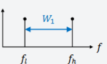
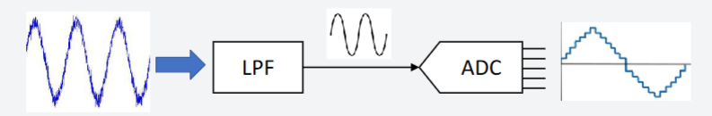
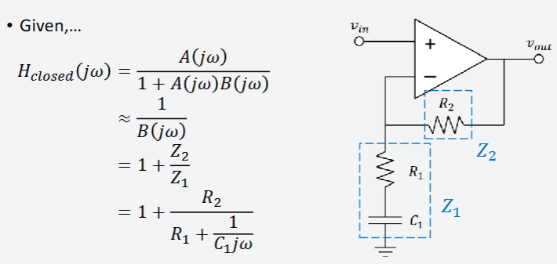
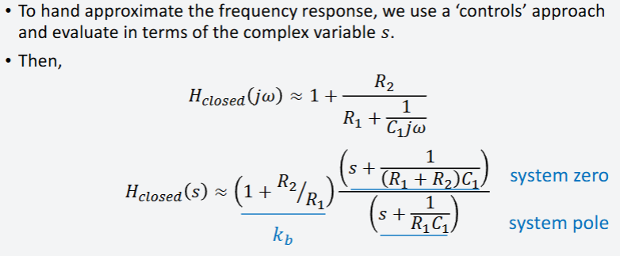
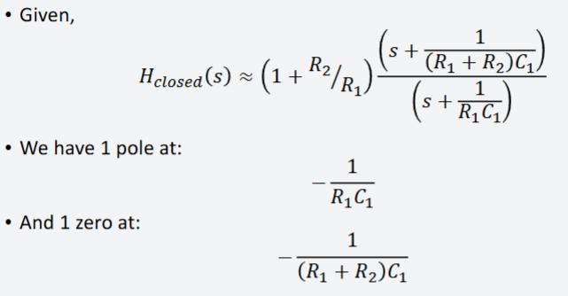
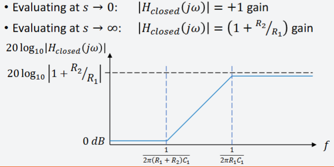

# Analog to Digital Converters

## Sampling Rate

**Sampling rate** (or sampling frequency) refers to the number of samples taken per second from an analog signal to convert it into a digital signal.

**Nyquist Theorem:**

- According to the Nyquist-Shannon sampling theorem, the sampling rate must be at least twice the maximum frequency present in the analog signal to accurately reconstruct the signal.

\[ f_s \geq 2 \times f_{max} \]

---

## Bandwidth

**Bandwidth** is the range of frequencies within a given signal.

In ADC context, bandwidth typically refers to the range of frequencies that the ADC can accurately sample and digitize. **Realize this is *NOT* the standard definition found in other electronic fields.**

**Anti-Aliasing Filters:**

- Usually placed before the ADC to ensure that the input signal bandwidth does not exceed half the sampling rate.
- Usually a low pass filter 

\[ BW \leq \frac{f_s}{2} \]

---

## Signal-to-Noise Ratio (SNR)
Signal-to-Noise Ratio (SNR) is an error metric used to measure the quality of the ADC output.

### Mathematical Representation

- Let the error between ADC input \( V(t) \) and digital output \( V_q(t) \) be:

\[ e(t) = V(t) - V_q(t) \]

- The SNR is defined as:

\[ SNR = \frac{E[V^2(t)]}{E[e^2(t)]} \]

### Importance

- Higher SNR means better ADC performance and less quantization error.

### SNR for an N-bit ADC

- For an N-bit ADC given a full-scale sine wave input, the SNR in decibels is:

\[ SNR_{dB} = 6.02 \times N + 1.76 \text{ dB} \]

- This is often simplified as approximately **6 dB per bit**.

### Example - Number of ADC Levels

- For an 8-bit ADC:

\[ SNR_{dB} = 6.02 \times 8 + 1.76 \approx 48 \text{ dB} \]

### Example – Step-size of ADC Levels

- **Question:** How many volts does each level step-size represent for an 8-bit ADC ranging from −1 V to +1 V?

- **Calculation:**

\[ \text{Step size} = \frac{\text{Voltage range}}{\text{Number of levels}} = \frac{2\,\text{V}}{256} \approx 7.8\,\text{mV/level} \]

**Note:** Amplitude \( A = 1\,\text{V} \), hence input voltage range is \( 2A = 2\,\text{V} \).

### Improving SNR

- Use a higher number of bits (higher resolution ADC).
- Amplify the input signal to fully utilize the ADC input range.

---

## Required Amplification and Input Offset Considerations

### Required Amplification

#### Scenario (i)

- If you can guarantee the peak-to-peak voltage of the original signal is \(\bar{V}_{sig}\), then the desired gain is:

\[ \text{Desired gain} = \frac{\text{ADC input range}}{\bar{V}_{sig, p-p}} \]

- **Example:** If the ADC range is 0 V to 5 V and \(\bar{V}_{sig, p-p} = 20\,\text{mV}\), then:

\[ \text{Desired gain} = \frac{5\,\text{V}}{20\,\text{mV}} = 250 \]

#### Scenario (ii)

- If you cannot guarantee the peak-to-peak voltage of the original signal, you should leave some 'headroom' to avoid overflow, which is worse for SNR.
- Typically, amplify the input signal to fill 1/8 to 1/2 of the ADC's input range.

### Input Offset Considerations

- Often the input signal is both positive and negative.
- The ADC input typically expects only positive inputs.
- Therefore, a DC offset must be applied.

**Example:**

- A full-scale signal might be represented as:

\[ v(t) = 2.5\sin(2\pi ft) + 2.5\,\text{V} \]

- If the original signal is \( v(t) = 0.004\sin(\omega t) \), you need to:

    1. Apply a DC offset.
    2. Amplify the signal.

- Different circuits and methods can achieve this for amplification and DC offset.

---
## Evaluating the Transfer Function

---

## Gain-Bandwidth Product (GBP)

The **Gain-Bandwidth Product (GBP)** is a key performance metric of an operational amplifier that defines the trade-off between gain and bandwidth. It states that for a given operational amplifier, the product of the closed-loop gain and the bandwidth remains constant.
  
\[
\text{Gain} \times \text{Bandwidth} = \text{GBP} (Hz)
\]

- This means that increasing the gain will reduce the available bandwidth and vice versa.

### Example Calculation

- Suppose an op-amp has a **GBP of 10 MHz**.
- If it is configured with a **gain of 400**, the bandwidth can be estimated as:

\[
\text{Bandwidth} = \frac{GBP}{Gain} = \frac{10 MHz}{400} = 25 kHz
\]

- This low bandwidth may limit high-frequency applications.

### Improving Bandwidth with Multiple Stages

- Instead of using a **single-stage amplifier** with a gain of 400, consider using **two cascaded amplifiers**, each with a gain of 20.
- If both amplifiers have a GBP of 10 MHz:
  
\[
\text{Bandwidth} = \frac{10 MHz}{20} = 500 kHz
\]
  
- This significantly increases the bandwidth compared to a single-stage design.

### Practical Considerations

- Higher gain configurations lead to reduced bandwidth, affecting high-speed applications.
- Using multiple amplifier stages distributes gain and helps maintain higher bandwidth.
- Important for **ADC signal conditioning** to ensure accurate data acquisition.

---

## HiLetgo ADS1256 5V 8 Channel 24 Bit ADC Data Acquisition Board Module

The HiLetgo ADS1256 is a high-precision, 24-bit analog-to-digital converter (ADC) data acquisition module. It provides excellent resolution and accuracy for analog signal measurement, suitable for various precision measurement applications.

- **Resolution:** 24-bit ADC providing extremely fine quantization.
- **Channels:** 8 single-ended or 4 differential analog input channels.
- **Operating Voltage:** 5V operation, compatible with most microcontrollers and development boards.
- **High Precision:** Designed for high-precision applications with low noise and high stability.
- **Data Rate:** Programmable data rates up to 30,000 samples per second (30 kSPS).

**The Good:**
- High sampling rate

**The Bad:**
- Works at 5V, too high for many gpios. Had to buy SN74AHCT125N to use for the teensy 4.0 and Jetson Nano

[Amazon](https://www.amazon.com/dp/B09KGXC44Q?ref=ppx_yo2ov_dt_b_fed_asin_title)

---
