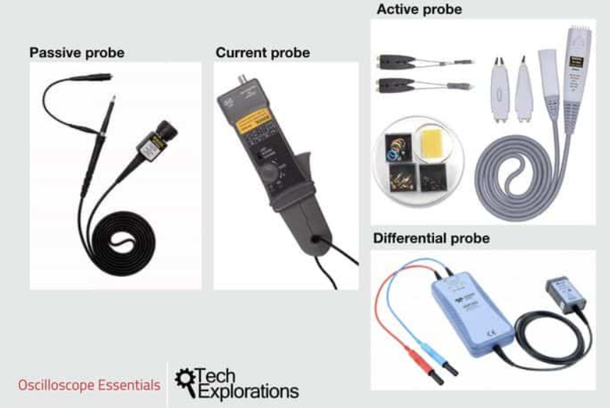
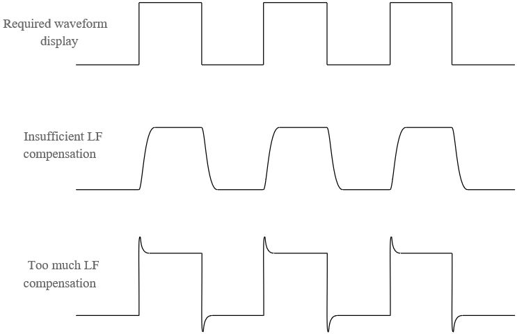

# Measuring Equipment

## Oscilloscope

### Probes

Oscilloscope probes connect the circuit under test to the oscilloscope. A typical probe consists of a **probe head**, **flexible cable**, and a **BNC connector** for oscilloscope input. The probe tip includes attachments like a spring-loaded hook for better contact and a ground connection (alligator clip).

**Types of Oscilloscope Probes**

1. **Passive Probes** – The most common type, available in **1×** (low-frequency, low-voltage) and **10×** (high-frequency, high-voltage) configurations.  
2. **Active Probes** – Include transistors and amplifiers, requiring power. Suitable for high-frequency, low-capacitance applications.  
3. **Differential Probes** – Measure voltage between two points instead of ground. Ideal for floating measurements.  
4. **Current Probes** – Detect magnetic fields from current flow and convert them to voltage. Used for non-intrusive current measurement.  

**Passive Probes: Ideal vs. Real**

An **ideal** probe would have infinite bandwidth and zero attenuation, but real probes have frequency-dependent behavior.  

- **1× Setting**: Used for signals <10 MHz and voltages <1V. Low-pass filter effect due to oscilloscope input capacitance.  
- **10× Setting**: Reduces amplitude by 10×, making it better for high-voltage, high-frequency signals. Compensation cancels out oscilloscope capacitance.  

**Probe Compensation**

Probe capacitance must be adjusted to match the oscilloscope’s internal capacitance for accurate measurements. Poor compensation results in distorted waveforms.  
**Steps:**  

1. Connect the probe to the oscilloscope’s compensation terminal.  
2. Adjust the probe’s capacitance using the small screw near the probe head until a clean square wave is displayed.  
3. Always compensate when switching probes or using different oscilloscope channels.  

**Setting 1× & 10× Probes**

Most measurements use **10× probes**. Ensure the oscilloscope matches the probe setting:  

- Some models autodetect 10× if the probe has a metal detection pin.  
- Otherwise, manually adjust the oscilloscope settings.  

**Probe Loading Effect**

Probes affect circuit behavior through **input resistance** and **input capacitance**:  

- **Input resistance** slightly reduces the measured signal’s amplitude.  
- **Input capacitance** loads the circuit, impacting rise times at high frequencies.  

📺 **Resources:**  

- [Probe Loading Affects Your Measurement – Tektronix](https://www.tek.com/en/video/industry-comparison/probe-loading-affects-your-measurement)  
- [EEVblog #453 – Mysteries of x1 Oscilloscope Probes Revealed](https://www.youtube.com/watch?v=OiAmER1OJh4)  
- [All About Circuits](https://www.allaboutcircuits.com/technical-articles/an-introduction-to-oscilloscope-probes/)

