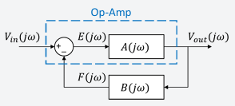
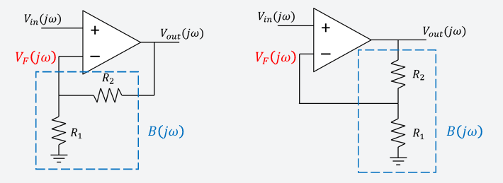
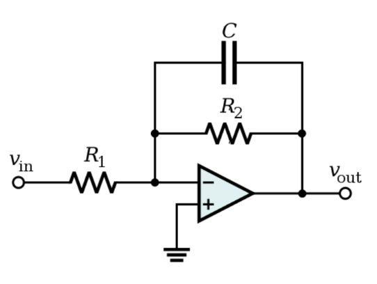

# Operational Amplifiers

## Negative Feedback

### Overview
Negative feedback is a crucial concept in operational amplifiers that enhances stability and control.

### Important Equations

- **Closed-loop Transfer Function (Gain):**

\[ H_{closed}(j\omega) = \frac{A(j\omega)}{1 + A(j\omega)B(j\omega)} \]

  - Where \( A(j\omega) \) is the open-loop gain
  - \( B(j\omega) \) is the feedback factor

-  The Non-Inverting Amplifier examples:

## Stability Considerations

### Overview
Understanding stability is essential to ensure that negative feedback systems do not lead to oscillations or performance degradation.

### Stability Analysis
- **Oscillations:** Occur if system poles are near or on the imaginary axis
- **Nyquist Stability Criterion:** Determines stability based on the system's loop gain
- **Routh-Hurwitz Criterion:** Used to analyze stability in the time domain

### Gain and Phase Margins
- **Gain Margin (G.M.)**: Distance (in dB) from 0 dB to magnitude at frequency \( f_{\pm180} \)
- **Phase Margin (P.M.)**: Distance (in degrees) from \( \pm180^\circ \) to the frequency where gain crosses 0 dB
- **Loop Gain Analysis:**

    \[ Loop Gain = A(j\omega)B(j\omega) \]

### Stability Guidelines
- A system is stable if **G.M. ≥ 10 dB** and **P.M. ≥ 45°**
- If the loop gain crosses \( -1 \) at a critical frequency, the system may oscillate

## Example: Transfer Function for Active Inverting Low-Pass Filter (LPF)

This example demonstrates how to compute the transfer function and the cut off frequnecy of a first-order inverting LPF using op-amp feedback.

[Example solved here](../assets/Example%20for%20Lecture%203a%20-%20Transfer%20Function%20for%20Active%20Inverting%20LPF.pdf)

## Example: Stability via Gain and Phase Margin

This example applies gain and phase margin concepts to assess system stability.

[Example solved here](../assets/EE%204113%20Lecture%203c%20-%20Stability%20of%20Negative%20Feedback%20Systems.pdf)

