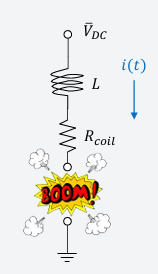
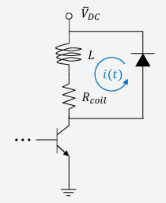
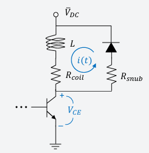

# Electronic Protection Strategies

This page provides an overview of strategies to protect your electronic circuits from voltage transients and other disturbances. It covers how to manage inductive voltage spikes (back EMF) and outlines common protection methods such as diode (snubber) circuits and additional transient suppression techniques.

## Protecting Against Inductive Spikes

When a circuit controls an inductive load (like a relay or motor coil), opening the switch abruptly causes the stored energy in the inductor to generate a high voltage spike (back EMF). This spike occurs because the inductor resists the sudden change in current, as described by:
  
| Equations                                                                                                                                     | Inductive Load Diagram                        |
|-----------------------------------------------------------------------------------------------------------------------------------------------|-----------------------------------------------|
| $V_{L}(t) = L \dfrac{d i(t)}{dt}$    $V_{CE}(t) = V_{DC} - L \dfrac{d i(t)}{dt} - i(t) R_{\text{coil}}$ |  |

This high voltage can damage switching devices (e.g., BJTs or MOSFETs) if not properly managed.

## Diode (Snubber) Protection

A common method to protect against back EMF is to use a diode, sometimes called a snubber or clamping diode:

| Description                                                                                                                                                       | Diagram                                 |
|-------------------------------------------------------------------------------------------------------------------------------------------------------------------|------------------------------------------|
| **Simple Diode Protection:**   - A diode is placed across the inductor in reverse bias.  - Under normal conditions, the diode remains inactive.  - When the switch opens and back EMF occurs, the diode becomes forward-biased, providing a safe path for the current and clamping the voltage to a safe level (approximately the supply voltage plus the diode drop). |  |
| **Diode with Series Resistor:**   - Adding a resistor in series with the diode decreases the time constant, speeding up the decay of the current.  - This configuration results in a faster turn-off rate, though it may increase the clamping voltage slightly.  - Choose the resistor value to balance rapid decay with acceptable voltage levels. |  |

## Additional Protection Techniques

Beyond diode protection, several methods can be used to safeguard your circuits:

- **RC Snubbers:** Resistor-capacitor networks can absorb transient energy and damp voltage spikes.
- **Metal Oxide Varistors (MOVs):** MOVs clamp overvoltage by absorbing energy, limiting voltage excursions.
- [Transient Voltage Suppressor (TVS) Diodes:](https://www.anypcba.com/blogs/electronic-component-knowledge/tvs-diodes-your-essential-guide-to-transient-voltage-suppression.html) TVS diodes are specifically designed to protect circuits from transient overvoltage events.
- **Combination Approaches:** Combining methods (such as diode protection with RC snubbers) often yields optimal results for robust circuit protection.